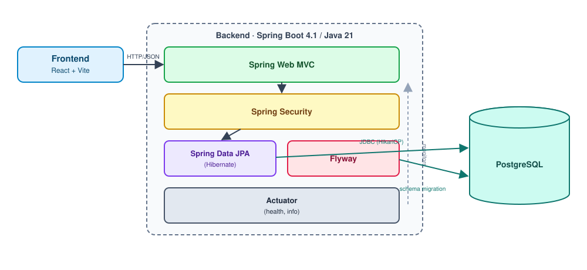

# neuringo-be

카카오테크 캠퍼스 4기 2단계 팀 프로젝트(전남대 4팀) 백엔드. Java 21 + Spring Boot 4.1 기반이며, 아직 비즈니스 API 없이 실행 환경(DB 연결·프로필·Actuator)만 구성된 상태입니다.

## 1. 아키텍처

로컬 실행 시에는 `spring-boot-docker-compose`가 `compose.yaml`을 자동으로 띄워 PostgreSQL 컨테이너에 연결합니다(아래 3번 참고). `local` / `dev` / `prod` 프로필별로 DB 접속 정보만 바뀌고 나머지 구조는 동일합니다.

## 2. 기술 스택 공식 링크

| 구분 | 스택 | 공식 링크 |
|---|---|---|
| 언어 | Java 21 | https://docs.oracle.com/en/java/javase/21/ |
| 프레임워크 | Spring Boot 4.1 | https://docs.spring.io/spring-boot/index.html |
| 웹 | Spring Web MVC | https://docs.spring.io/spring-framework/reference/web/webmvc.html |
| 인증/인가 | Spring Security | https://docs.spring.io/spring-security/reference/index.html |
| 데이터 접근 | Spring Data JPA | https://docs.spring.io/spring-data/jpa/reference/index.html |
| ORM | Hibernate ORM | https://hibernate.org/orm/documentation/ |
| 검증 | Bean Validation (Jakarta) | https://docs.jboss.org/hibernate/stable/validator/reference/en-US/html_single/ |
| DB | PostgreSQL | https://www.postgresql.org/docs/ |
| 커넥션 풀 | HikariCP | https://github.com/brettwooldridge/HikariCP |
| 마이그레이션 | Flyway | https://documentation.red-gate.com/fd |
| 빌드 도구 | Gradle (Wrapper) | https://docs.gradle.org/current/userguide/userguide.html |
| 테스트 | JUnit 5 | https://junit.org/junit5/docs/current/user-guide/ |
| 로컬 DB 컨테이너 | Spring Boot Docker Compose | https://docs.spring.io/spring-boot/reference/features/dev-services.html |
| 컨테이너 | Docker Compose | https://docs.docker.com/compose/ |
| CI | GitHub Actions | https://docs.github.com/actions |
| 정적 분석 | CodeQL | https://codeql.github.com/docs/ |

## 3. 로컬 환경설정 (육하원칙)

| 육하원칙 | 내용 |
|---|---|
| 누가 | 이 백엔드를 로컬에서 처음 실행하는 팀원이 |
| 언제 | 레포를 clone한 직후, 최초 1회 |
| 어디서 | `backend/` 디렉터리에서 |
| 무엇을 | JDK 21과 PostgreSQL(직접 설치 또는 Docker) 환경을 |
| 왜 | Spring Boot 앱 구동에 Java 21 툴체인과 DB 연결이 필수라서 |
| 어떻게 | 아래 단계대로 준비한다 |

**단계별 실행**

1. JDK 21을 준비한다. (IntelliJ 사용 시 `Settings → Gradle → Gradle JVM`도 21 이상으로 맞춘다.)
2. Docker가 설치·실행 중인지 확인한다. (별도 Postgres 설치 없이 자동 실행됨)
3. `backend/` 에서 `./gradlew bootRun` 을 실행한다.
4. `spring-boot-docker-compose`가 `compose.yaml`을 읽어 PostgreSQL 컨테이너를 자동으로 띄운다.
5. `http://localhost:8080/actuator/health` 응답이 `UP`이면 정상 기동이다.

Docker 없이 직접 설치한 PostgreSQL을 쓰고 싶다면, `local` 프로필로 실행하고 `.env.example`을 참고해 `SPRING_PROFILES_ACTIVE=local`, `DB_URL`, `DB_USERNAME`, `DB_PASSWORD` 환경변수를 직접 지정하면 된다.
