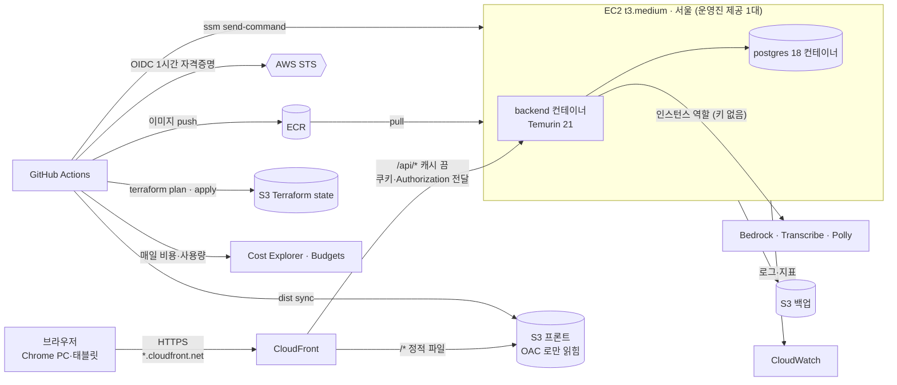
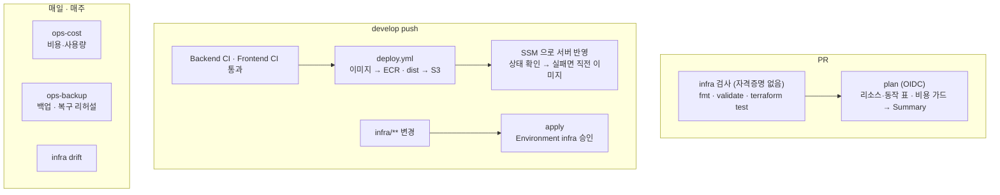

# CD·인프라 설계 (AWS)

S1·S2·S8-JEONG-02(EC2·RDS, VS-017)의 배포 설계다. 운영진이 준 AWS 실습 환경(팀 계정 1개, 서버 1대)에 맞췄다.

- **인프라도 코드(Terraform)로 만들고 GitHub Actions 로만 바꾼다.** 콘솔에서 손으로 만들지 않는다.
- **비용·사용량도 파이프라인이 매일 본다.** 기관이 비용을 내더라도 팀이 보고 줄인다.
- 상태: 설계안(2026-10-01). ⚑ 표시는 0단계 권한 확인(`aws-probe.yml`) 결과로 정한다.
- 진행(2026-10-05): 1단계 중 서버 스크립트(`deploy/host/`), 배포 워크플로(`deploy.yml`·`host-setup.yml`·`ops-backup.yml`), Terraform(`infra/`)과 `infra.yml` 을 만들었다. `ops-cost.yml` 이 남았다. 실제 적용은 0단계 권한 확인 뒤다.

## 한눈에



| 무엇 | 정한 것 | 이유 | ⚑ 바뀌는 조건 |
|---|---|---|---|
| 배포 대상 | 운영진 EC2 1대 + 관리형 서비스(S3·ECR·CloudFront·SSM·CloudWatch) | 서버 추가·사양 변경·삭제가 막혀 있다 | — |
| 배포 인증 | GitHub OIDC → `ktc-github-deploy`(모자라면 팀 최소 권한 역할) | 팀 계정에서 액세스 키를 만들 수 없다 | ⚑1 |
| 서버 반영 | `aws ssm send-command` | 22번을 열지 않는다(운영진 OIDC 가이드 5절). 지금 `deploy-dev.yml` 의 SSH 방식은 버린다 | — |
| 이미지 저장소 | ECR (GHCR 대신) | 서버가 인스턴스 역할로 받는다. 저장할 비밀이 없다 | ⚑2 서버 역할에 ECR 권한이 없으면 이미지 파일을 S3 로 옮긴다 |
| 주소·HTTPS | CloudFront 기본 주소 `https://<id>.cloudfront.net` | 카메라·마이크는 HTTPS 화면에서만 열린다. 도메인·ALB·인증서 없이 HTTPS 가 된다 | ⚑3 막혀 있으면 API Gateway(HTTP API) 기본 주소 |
| 프론트 | S3 + CloudFront, `/api/*` 만 EC2 로 | 화면과 API 가 같은 출처라 dev·prod 보안 설정(CORS 없음, 세션 CSRF)을 바꾸지 않는다. 서버 메모리도 아낀다 | — |
| DB | 지금은 EC2 의 postgres 컨테이너 + 매일 S3 백업. 운영 분리 때 RDS 를 요청한다 | RDS 생성이 막혀 있고(요청 시 검토) 무료가 아니다 | 승인되면 Terraform `use_rds` 로 바꾼다 |
| 모델 | Bedrock(LLM) · Transcribe(STT) · Polly(TTS) | SageMaker 차단, 서버는 GPU 없는 4 GiB 1대 | ⚑5. 자체 모델은 §6 |
| 인프라 관리 | Terraform 1.16.4 · AWS provider 6.67.0. PR 에서 자격증명 없는 검사, develop 머지 뒤 plan 표 → 승인 → apply, 매일 drift 검사 | 인프라 변경도 리뷰·이력·되돌리기를 거친다 | — |
| 비용 | AWS Budgets·이상 탐지 + 매일 비용·사용량 보고 + plan 비용 가드 | §7 | ⚑4 |

## 0단계 — 권한 확인

운영진 역할의 권한 범위는 문서에 없다. 설계의 갈림길(⚑)을 먼저 확인한다. `aws-probe.yml` 은 읽기 호출과 IAM 정책 시뮬레이션만 하고 아무것도 만들지 않는다. 공개 레포라 계정 ID·ARN·ID·주소는 찍지 않는다.

1. Settings → Secrets and variables → Actions → **Variables** 에 `AWS_ACCOUNT_ID`(12자리)를 등록한다. secret 이 아니라 변수다(운영진 OIDC 가이드 1-1).
2. 이 브랜치가 develop 에 들어간 뒤 Actions → **AWS probe** → Run workflow. 수동 실행 워크플로는 기본 브랜치에 있어야 버튼이 보인다.
3. 실행 Summary 의 표를 아래 ⚑ 표에 옮기고 결정 칸을 채운다.

로컬에서도 돌릴 수 있다: `aws configure sso` → `aws sso login` → `bash scripts/aws-probe.sh`. 1절은 SSO 역할로 나오지만 4·5절 시뮬레이션은 같은 역할(`ktc-github-deploy`·서버 역할)을 본다.

| ⚑ | 무엇 | probe 에서 볼 곳 | 결과 | 결정 |
|---|---|---|---|---|
| 1 | 배포 역할로 Terraform·배포가 되나 | 4절 전체 | 확인 전 | 되면 그대로 / 안 되면 팀 역할 3개(§4) |
| 2 | 서버 역할로 ECR·S3·Parameter Store·로그·Bedrock | 5절 | 확인 전 | 안 되면 운영진 요청(§12-2). 그동안 이미지는 S3, 로그는 서버 파일 |
| 3 | CloudFront | 2절 배포 목록, 4절 HTTPS 앞단 | 확인 전 | 안 되면 API Gateway HTTP API |
| 4 | Budgets·Cost Explorer·이상 탐지 | 2절·4절 비용 | 확인 전 | 안 되면 파이프라인 보고만 |
| 5 | Bedrock·Polly·Transcribe | 2절, 5절 | 확인 전 | 이건우의 모델 결정(§6)에 넘긴다 |

## 1. 조건

### 운영진 AWS 환경 (가이드, 2026-10-01 확인)

| 구분 | 내용 |
|---|---|
| 제공 | 팀 계정 1개 · EC2 1대 `t3.medium`(2 vCPU · 4 GiB) · Ubuntu 24.04 · 디스크 50 GB · 서울 · **2026-08-31 ~ 11-20** |
| 막힘 | 서버 추가·사양 변경·삭제, 디스크 확장·추가 볼륨, Elastic IP, RDS·ALB(요청 시 검토), NAT Gateway·EKS·SageMaker·ElastiCache 등, 서울 밖 리전, IAM 사용자·액세스 키, CloudTrail 변경, Spot·Auto Scaling |
| 자유 | 서버 중지·시작·재부팅, 보안 그룹 규칙, 서버 안 설치, S3·DynamoDB·Lambda·CloudWatch·ECR·API Gateway·SQS/SNS |
| 접속·배포 | 사람은 SSO + SSM Session Manager(22번 없음). CI 는 OIDC 역할 `ktc-github-deploy`(운영진 관리라 수정 불가, 세션 최대 1시간). 서버는 `ktc-ec2-ssm-role`. 팀이 IAM **역할**은 만들 수 있다(경로 `/ktc/` 금지, AdministratorAccess 금지) |
| 감시 | CloudTrail·GuardDuty·예산 모니터링이 늘 켜져 있다 |

### 팀 문서에서 오는 것

| 출처 | 요구 |
|---|---|
| 07 P0-JEONG-02 · 08 S1-JEONG-02 | 분리된 개발 컨테이너·개발 DB 에 테스트 MVP. **사용자 테스트용 URL 에서 종단 흐름이 동작한다**(늦어졌다 → 1단계 최우선) |
| 08 S2-JEONG-02 | 테스트 환경 상태·비식별 로그·오류 추적 |
| 08 S3-JEONG-02 | 로그 PII 필터, 추적 ID, 30일 보관 기준 |
| 08 S8-JEONG-02 | 로그·추적 ID·비밀값·개발/운영 분리·릴리스 후보 검증 |
| 08 결정 Gate | DEC-018(배포·롤백)·DEC-038(운영 RDS 계정 방식) — 스프린트 8 착수 전 |
| 03 VS-017 | 지연·단계별 실패율·재시도 성공률·기본 응답 사용률을 본다. 모델·프롬프트·안전·난이도 정책 버전을 실행 결과에 연결한다. 오류 증가를 내부 지표로 알아챈다 |
| 08 공개 배포 Gate | 실제 개인정보 공개 배포 전 DEC-004·028·035·036·040·052. 그 전까지 AWS 환경에는 **테스트 데이터만** 둔다 |
| 06 DEC-007 | 원본 음성은 사전 서명 업로드, 릴리스에서는 세션이 끝나면 삭제 |

### 레포 지금 상태 — 배포 전에 풀 것

| 무엇 | 지금 | 할 일 | 누가 |
|---|---|---|---|
| 프론트 API 주소 | `frontend/src/features/instructor/api.ts` 에 `http://localhost:8080/api/v1` 고정 | 빌드 변수 `VITE_API_BASE_URL`(기본 `/api/v1`). 로컬·E2E 는 지금 값 유지 | 배재일(테스트 정민서) |
| CORS·CSRF | dev·prod 는 CORS 없음, CSRF 는 서버 세션 | 바꾸지 않는다. CloudFront 로 같은 출처를 만든다 | — |
| 세션 쿠키 | ✅ #32 에서 dev·prod 기본 `Secure`(`SESSION_COOKIE_SECURE`, 기본 true) | 그대로 쓴다(화면은 CloudFront HTTPS) | — |
| 상태 확인 | `/actuator/health` 가 401 | 배포 확인은 서버 안에서 `GET /api/v1/csrf` 200. health 공개 여부는 팀이 정한다(§11) | 배재일·정민서 |
| 메모리 | ✅ compose 에 `mem_limit`(backend 1.5 GiB·postgres 768 MiB). 전에는 상한이 없어 JVM 이 서버 4 GiB 기준으로 힙을 잡았다 | — | 정민서 |
| 배포 골격 | ✅ GHCR + SSH(`deploy-dev.yml`)를 지우고 `deploy.yml`(OIDC·ECR·SSM)로 바꿨다. 값은 `deploy/host/params.txt` 목록대로 Parameter Store 에서, `DB_URL` 은 덮어쓸 수 있다(RDS 대비) | — | 정민서 |
| AI 설정 | `AI_BASE_URL` 은 `/v1` 까지 적어야 하고 `AI_MODEL` 이 필수, 제한 시간 10초(PoC p95 9~15초) | 값은 Parameter Store. 제한 시간은 담당자와 정한다 | 이건우·진미나 |
| 관측 | 평문 로그, 지표 없음, 추적 ID 는 TODO | §9 | 정민서 |

## 2. 구성

### 요청이 가는 길

- `https://<배포>.cloudfront.net/…` → **S3**(프론트 `dist`).
  - 버킷은 비공개이고 CloudFront(OAC)만 읽는다.
  - 주소에 확장자가 없으면 CloudFront Function 이 `/index.html` 로 바꾼다(SPA 새로고침·딥 링크).
  - 사용자 지정 오류 응답(403·404 → index.html)은 쓰지 않는다. 배포 전체에 걸려서 `/api` 의 404·403 까지 HTML 200 으로 바뀐다.
- `/api/*` → **EC2 80번**(HTTP).
  - 캐시 정책 `Managed-CachingDisabled`, 원본 요청 정책 `Managed-AllViewerExceptHostHeader`.
  - CloudFront 는 GET·HEAD 의 `Authorization` 헤더를 기본으로 지운다. 강사 화면은 GET 에도 Bearer 토큰을 싣는다 → 이 정책으로 헤더·쿠키·쿼리를 모두 넘긴다.
  - 원본 응답 제한 시간은 기본 30초다(AI 한 턴 p95 15초 안).
- 화면과 API 가 같은 출처라 쿠키·CSRF·CORS 가 지금 코드 그대로 동작한다.
- 보안 그룹 인바운드는 **CloudFront 원본용 관리형 접두사 목록(`com.amazonaws.global.cloudfront.origin-facing`) → TCP 80** 하나다. 22번은 열지 않는다. 이 접두사 목록은 보안 그룹 규칙 한도를 여러 칸 차지하므로 다른 규칙을 거의 두지 않는다.

### EC2 안

| 무엇 | 이미지·설치 | 메모리 상한 | 비고 |
|---|---|---|---|
| backend | ECR `neuringo/backend:<커밋 SHA>` | 1.5 GiB (`MaxRAMPercentage=75` → 힙 약 1.1 GiB) | 호스트 80 → 컨테이너 8080 |
| postgres | `postgres:18.6` | 768 MiB | 포트 비공개, 이름 있는 볼륨, 매일 백업 |
| 호스트 | Docker·Compose 플러그인, SSM Agent, CloudWatch Agent, swap 2 GiB | 약 0.6 GiB | `/opt/neuringo` 아래 compose·`.env`·스크립트 |

- 남는 메모리는 약 1 GiB 다.
- 서버에서 이미지를 빌드하지 않는다(t3 CPU 크레딧·메모리). 빌드는 GitHub Actions 에서 한다.
- 공인 IP 가 Elastic IP 가 아니라서 **서버를 중지했다 시작하면 IP 가 바뀐다**(재부팅은 그대로). 그러면 CloudFront 원본 주소도 바꿔야 하므로 `infra.yml` 을 다시 돌린다. 막으려면 Elastic IP 를 요청한다(§12). Elastic IP 는 지금 자동 공인 IP 와 시간당 요금이 같아서, 붙여 두는 동안 추가 비용이 거의 없다.

### Terraform 이 만드는 것

| 리소스 | 이름(예) | 설정 |
|---|---|---|
| S3 state | `neuringo-tfstate-<계정>` | 버전 관리·암호화·공개 차단·HTTPS 만. `use_lockfile`(DynamoDB 없이 잠금). Terraform 밖(`scripts/tf-state.sh`)에서 만든다 |
| S3 프론트 | `neuringo-dev-web-<무작위>` | 비공개, CloudFront OAC 만 읽는다 |
| Parameter Store 인프라 값 | `/neuringo/dev/infra/…` | ECR 주소·버킷·CloudFront 배포 ID·주소. 워크플로가 읽는다(`scripts/infra-outputs.sh`) |
| S3 백업 | `neuringo-dev-backups-<무작위>` | DB 덤프, 14일 뒤 삭제 |
| ECR | `neuringo/backend` | 태그 불변, 푸시할 때 스캔, 최근 10개만 보관 |
| CloudFront | 배포 1개 + OAC + Function | 원본 2개(S3·EC2), `PriceClass_200`(한국 엣지 포함) |
| 보안 그룹 규칙 | 운영진 보안 그룹에 규칙만 더한다 | CloudFront 접두사 목록 → 80 |
| Parameter Store | `/neuringo/dev/…` | 설정값(String)·비밀값(SecureString). 비밀값은 쓰기 전용 인자로 넣어 state 에도 안 남긴다 |
| CloudWatch | 로그 그룹 `/neuringo/dev/backend`(30일), 경보, 대시보드 | §7·§9 |
| SNS | `neuringo-dev-alerts` | 경보·예산 알림 메일 |
| Budgets·이상 탐지 | 월 예산 1개, 모니터 1개 | ⚑4 |
| IAM | 팀 역할·정책 | ⚑1·⚑2 |

운영진 소유는 읽기만 한다(data source): EC2 인스턴스·VPC·서브넷·보안 그룹 자체, `ktc-github-deploy`, `ktc-ec2-ssm-role`.

## 3. 파이프라인



| 파일 | 언제 | 하는 일 | AWS 역할 |
|---|---|---|---|
| `aws-probe.yml` | 수동(0단계) | 읽기 호출·IAM 시뮬레이션으로 ⚑ 확인. 아무것도 만들지 않는다 | `ktc-github-deploy` |
| `infra.yml` | `infra/**`·`scripts/tf-*` 변경 PR · develop push · 매일 · 수동 | PR: 자격증명 없는 검사만(fmt·validate·mock 테스트·구성 검사). PR 에는 AWS 자격증명을 주지 않는다. develop: plan(표·가드, 승인 전엔 읽기만) → Environment `infra` 승인 → 가드 다시 → apply(승인한 plan 과 리소스·동작이 같을 때만). 매일: drift(plan 에 변경이 있으면 실패, 서버가 꺼져 있으면 건너뜀) | plan 은 읽기, apply 는 쓰기 |
| `deploy.yml` (`deploy-dev.yml` 대체) | develop 에서 Backend CI·Frontend CI 가 통과한 커밋(`workflow_run`) · 수동(SHA 를 넣어 되돌리기) | 백엔드: 이미지 빌드 → ECR(SHA 태그) → SSM 으로 반영·상태 확인·실패 시 되돌림. 프론트: 빌드 → S3 sync → `/index.html` 무효화 | deploy |
| `ops-backup.yml` | 매일 03:00 KST · 수동 | 서버에서 `pg_dump` → S3, 이어서 같은 서버의 임시 postgres 에 복구해 테이블·마이그레이션·행 수 확인. 데이터가 AWS 밖(러너)으로 나가지 않는다 | deploy |
| `ops-cost.yml` | 매일 09:30 KST · 수동 | §7 비용·사용량 표. 기준을 넘으면 실패 | 읽기 |
| `host-setup.yml` | 수동 | 서버 기본 설정 스크립트(`deploy/host/setup.sh`, 여러 번 돌려도 결과가 같다)를 SSM 으로 실행: Compose 플러그인·swap·CloudWatch Agent·`/opt/neuringo`·보안 업데이트 | deploy |

- 배포·apply 는 한 번에 하나만 하고 도중에 취소하지 않는다(concurrency).
- 비밀값은 워크플로 입력·SSM 명령 인자에 싣지 않는다. 명령 내용은 SSM 기록·CloudTrail 에 남는다. 서버가 Parameter Store 에서 직접 읽는다.
- PR(같은 레포 포함)에는 AWS 자격증명을 주지 않는다. 배포 역할에 쓰기 권한이 있어서다. 자격증명이 필요 없는 검사는 모든 PR 에서 돌고, plan 표는 develop 에 들어간 뒤 승인 전에 본다.
- 수동 실행 워크플로(Host setup·Ops backup·AWS probe·Deploy)는 develop 에서만 돈다. 다른 브랜치를 고르면 그 브랜치의 스크립트가 서버·자격증명으로 돌기 때문이다.
- `workflow_run` 은 같은 레포 develop push 에서 온 실행만 받는다(`head_repository` 확인).
- 공개 레포라 로그·Summary 가 공개된다. 계정 ID·ARN·리소스 ID·주소는 찍지 않는다(`mask-aws-account-id`).

### 배포·되돌리기 (DEC-018 제안)

1. 이미지 태그는 커밋 SHA 하나만 쓴다. ECR 태그 불변이라 같은 태그를 덮어쓰지 못한다. `:dev` 같은 움직이는 태그는 쓰지 않는다.
2. 서버 스크립트(`deploy/host/deploy.sh`) 순서:
   - 배포 묶음(compose·스크립트)은 SSM 명령에 실어 보낸다(`scripts/release-bundle.sh`, S3 를 거치지 않는다). 서버는 SHA256 을 확인하고 `releases/<SHA>` 에 푼다.
   - `.env` 를 Parameter Store 에서 만든다(권한 600).
   - 배포 전에 `pg_dump` 한다.
   - 새 이미지로 `up -d` 하고 120초 안에 `GET /api/v1/csrf` 200 을 기다린다.
   - 안 되면 **직전 이미지로 되돌리고** 실패로 끝낸다.
3. 성공하면 워크플로가 `/neuringo/dev/release/backend`(지금)·`…/previous`(직전)를 고치고 Summary 에 주소·SHA·이미지 digest 를 적는다.
4. DB 는 앞으로만 간다(Flyway). 되돌릴 수 있게 **확장 → 전환 → 축소** 순서를 지킨다. 컬럼 추가는 하위 호환으로 먼저 하고, 삭제·이름 바꾸기는 다음 릴리스에서 한다. 스키마까지 되돌려야 하면 배포 전 백업으로 복구한다(수동 실행).
5. 수동으로 되돌릴 때는 `deploy.yml` 에 SHA 를 넣어 실행한다.

### 환경

| 환경 | 브랜치 | 승인 | DB | 데이터 |
|---|---|---|---|---|
| dev (사용자 테스트 겸) | develop push → 자동 | 없음 | EC2 컨테이너 | 테스트 데이터만 |
| prod (스프린트 8) | main | Environment `prod` 승인 | RDS(승인되면) 또는 별도 컨테이너 | 실제 개인정보는 공개 배포 Gate 뒤 |

서버가 1대(4 GiB)라 dev·prod 를 오래 같이 띄우지 않는다. prod 를 띄우면 dev 는 필요할 때만 켠다. 설정값은 경로로 나눈다(`/neuringo/dev/…`, `/neuringo/prod/…`).

## 4. 인프라를 코드로 (Terraform)

- 콘솔에서 만들지 않는다. 운영진 소유는 data source 로 읽기만 한다.
- 손으로 만든 게 생기면 `import` 블록으로 코드에 가져온다. 매일 drift 검사로 어긋남을 찾는다.
- 바꾸는 길은 PR → plan 리뷰 → develop 머지 → apply 하나뿐이다.

```text
infra/                  사용법: infra/README.md
  live/dev/             dev 루트 모듈 (backend "s3", use_lockfile = true — 값은 infra.yml 이 넘긴다)
  live/prod/            스프린트 8
  modules/
    edge/               CloudFront · S3 프론트 · OAC · Function · 보안 그룹 규칙
    registry/           ECR · 수명 주기
    storage/            S3 백업(·음성 원본) · 암호화 · 공개 차단 · 수명 주기
    config/             Parameter Store
    observability/      로그 그룹 · 경보 · 대시보드 · SNS
    cost/               Budgets · 이상 탐지
    data/               RDS (use_rds = true 일 때만)
    */tests/            terraform test (mock provider)
scripts/
  tf-state.sh           state 버킷 확인·생성. Terraform 이 자기 state 를 둘 곳이라 밖에서 만든다(bootstrap 대신)
  tf-plan-guard.mjs     plan 비용·안전 가드
  tf-run.sh             고정 이미지로 실행, 공개 로그용으로 오류를 가린다
```

- **버전**: Terraform `1.16.4`(이미지 `hashicorp/terraform:1.16.4` — 로컬·CI 모두 이 이미지로만 돌린다), `hashicorp/aws` `= 6.67.0`, `hashicorp/random` `= 3.9.1`. `.terraform.lock.hcl` 을 커밋한다(모든 플랫폼 `zh:` 해시 + 이미지 플랫폼 linux_amd64 `h1:` 해시). tflint `0.64.0`·trivy `0.74.0` 은 도구 이미지를 받기로 정한 뒤 더한다. [github-actions.md](github-actions.md) 버전 표에 같이 적는다.
- **태그**: `Project=neuringo`·`Env`·`ManagedBy=terraform`·`Owner=VS-017`(provider `default_tags`). 팀 계정은 팀 전용이라 계정 합계가 곧 팀 비용이다. 태그는 정리·검색용이다(비용 할당 태그 켜기는 결제 계정 몫이라 기대하지 않는다).
- **비밀값**: `ephemeral "random_password"` + `aws_ssm_parameter` 의 `value_wo`(쓰기 전용, Terraform 1.11+) → plan·state 에 남지 않는다. 외부 AI 키처럼 사람이 넣는 값은 담당자가 Parameter Store 에 직접 넣고, Terraform 은 이름만 안다.
- **역할(⚑1)**: `ktc-github-deploy` 로 plan·apply·배포가 다 되면 그대로 쓴다. 아니면 가이드 8절대로 팀 역할을 나눈다.

| 역할 | 맡는 주체(OIDC `sub`) | 권한 |
|---|---|---|
| `neuringo-gha-plan` | 같은 레포의 PR·브랜치 | 읽기 + state 읽기·잠금 |
| `neuringo-gha-apply` | Environment `infra` 의 job 만 | Terraform 이 만드는 리소스만 |
| `neuringo-gha-deploy` | Environment `dev`·`prod` 의 job 만 | ECR push, S3 프론트, SSM 명령, Parameter Store 읽기, CloudFront 무효화 |

신뢰 정책의 `sub` 는 가이드대로 이름 형식과 숫자 ID 형식을 함께 건다. 예: `repo:kakaotechcampus-4/ktc4-chonnam-4:environment:infra`, `repo:kakaotechcampus-4@287968646/ktc4-chonnam-4@1340154773:environment:infra`. 레포 와일드카드·`/ktc/` 경로·AdministratorAccess 는 쓰지 않는다.

PR 에서 자격증명 없이 도는 검사(`bash scripts/verify.sh infra` 와 같다):
- `terraform fmt -check`, `validate`. tflint(AWS 규칙)·`trivy config`(설정 보안)는 도입 전
- `terraform test` + mock provider
  - 버킷은 공개 차단·암호화, 화면 버킷은 OAC 로만 읽힌다. 백업은 14일 뒤 지우고 HTTPS 만 받는다.
  - 로그 그룹은 30일 보관이다.
  - ECR 은 태그 불변·푸시할 때 스캔·최근 10개다.
  - 보안 그룹 인바운드는 CloudFront 접두사 목록 80 뿐이다.
  - CloudFront: HTTPS 만, `PriceClass_200`, `/api/*` 는 캐시 끔·Authorization·쿠키 전달.
  - 비밀값은 SecureString·쓰기 전용이다. Parameter Store 이름이 `infra-outputs.sh`·`params.txt` 와 맞는다.
- 비용 가드(§7)는 plan 이 있어야 하므로 plan 잡에서 돈다.

## 5. DB — RDS 를 쓸 수 있나

**지금 조건에서 무료는 어렵다. 싸게는 쓸 수 있지만 운영진 승인이 먼저다.**

- RDS 생성이 막혀 있다(가이드 5절, 요청 시 검토).
- 팀 계정은 운영진 조직(AWS Organizations)의 멤버 계정이다. 2025-07 이후의 Free Plan 크레딧은 조직에 들어간 계정에는 없고, 예전 프리 티어도 조직 전체 기준으로 센다(AWS Free Tier 약관). "RDS 무료"는 기대하지 않는다. 비용은 기관 예산에서 나간다.
- 가장 싼 구성: `db.t4g.micro`(2 vCPU · 1 GiB, Graviton) 단일 AZ, gp3 20 GB, 자동 백업 7일, 공개 접근 끔. 서울 온디맨드 약 18 USD/월 + 저장소 몇 USD → **월 20 USD 안팎, 남은 기간(10/1~11/20) 약 35 USD**(추정).
- PostgreSQL 18 은 RDS 가 지원한다(2026-05 기준 18.4). 팀은 `18.6` 으로 고정했으므로 RDS 로 가면 CI·Testcontainers 를 RDS 가 주는 18.x 로 맞춘다.

| | EC2 의 postgres 컨테이너 | RDS `db.t4g.micro` |
|---|---|---|
| 추가 비용 | 0 | 월 약 20 USD |
| 승인 | 필요 없음 | 운영진 요청 |
| 백업 | 매일 `pg_dump` → S3(파이프라인) + 매주 복구 리허설 | 자동 백업, 특정 시점 복구 |
| 서버 메모리 | 0.5~0.75 GiB 차지 | 0(앱에 더 준다) |
| 장애 범위 | 서버가 죽으면 DB 도 멈춘다 | 앱 서버와 따로 |
| 옮기기 | — | `DB_URL` 만 바뀐다(Parameter Store). 데이터는 `pg_dump`/`pg_restore` |

추천:
- **지금은 EC2 컨테이너**(추가 비용 0)로 사용자 테스트·개발을 한다. 백업·복구는 파이프라인으로 증명해 둔다.
- **DEC-038(스프린트 8 전)에 운영 DB 로 RDS 를 요청**한다(§12 초안). Terraform 에 `use_rds` 스위치와 모듈을 미리 둔다.
- RDS 에서는 Flyway 가 앱 계정으로 돌므로 그 계정에 스키마 CREATE 권한을 준다(PostgreSQL 15+ 는 public 스키마에 기본 권한이 없다). 접속은 `sslmode=require`.

## 6. 모델을 AWS 에서

SageMaker 가 막혀 있고 서버는 추가·사양 변경이 안 되는 GPU 없는 4 GiB 1대다. **이 조건으로는 LLM 을 직접 띄워 서빙할 수 없다.** CPU 로 작은 모델을 돌리면 아이 대화에 쓸 만한 지연이 안 나온다(PoC 의 호스팅 API 도 한 턴 p95 9~15초).

| 길 | 무엇 | 비용(추정) | 코드 | 승인 |
|---|---|---|---|---|
| **A. 관리형 (추천)** | Bedrock(LLM) · Transcribe 스트리밍(STT, ko-KR) · Polly(TTS, 서연 neural) | 쓴 만큼. Claude Haiku 4.5(apac) 입력 1.10·출력 5.50 USD/100만 토큰, Nova Micro(서울) 0.041·0.164, Polly neural 16 USD/100만 글자 | `LlmProvider` 어댑터 추가(Spring AI Bedrock Converse). 지금 `SpringAiLlmProvider` 는 OpenAI 옵션에 묶여 있다 | ⚑2·⚑5 서버 역할 권한, 모델 접근 |
| B. 작은 자체 모델 | 분류기·정규화 같은 작은 모델을 Lambda 컨테이너(메모리 최대 10 GB, CPU)로 | 호출당 | Lambda 함수 + 호출 코드 | 필요 없음(Lambda 허용) |
| C. LLM 직접 서빙 | GPU 인스턴스(예: g4dn) | 서버 1대 고정이라 앱 서버 자체를 GPU 로 바꿔야 하고, 시간당 비용이 지금 서버의 10배를 넘는다 | OpenAI 호환 서버(vLLM 등) → `AI_BASE_URL` 만 바꾼다 | 운영진 사양 상향 요청 |
| D. 지금처럼 외부 | Elice MLAPI(OpenAI 호환) | 그대로 | 없음 | 없음 |

- 예: 역할극 한 턴에 호출 3~4번(분석·후보·평가·안전), 호출당 입력 약 2,000·출력 약 300 토큰이면 Haiku 4.5 로 턴당 약 0.015 USD, 1,000턴 약 15 USD 다. Nova Lite 면 1,000턴 약 1 USD 다.
- **추천은 A**다. "AWS 에 모델을 올린다"를 관리형으로 채운다. 모델 선택·품질·토큰 비용은 이건우, 어댑터·실패 처리는 진미나, 권한·지표·비용 상한·배포는 정민서가 맡는다.

A 를 위한 인프라 준비:
- 서버 역할 정책 `neuringo-ec2-app`: `bedrock:InvokeModel`·`InvokeModelWithResponseStream`(쓰는 모델·추론 프로필만), `transcribe:StartStreamTranscription*`, `polly:SynthesizeSpeech`. 서버 역할이 운영진 소유라 붙이지 못하면 요청한다(§12-2).
- 지표: CloudWatch `AWS/Bedrock`(호출 수·입력·출력 토큰·지연·오류)을 모델별로 대시보드와 비용 보고에 넣는다.
- 비용 상한: 앱 설정으로 하루 토큰 상한과 요청당 `max_tokens` 를 둔다. 넘으면 고정 안내(기본 응답)로 가고, VS-017 의 기본 응답 사용률에 잡힌다.
- 음성 원본(DEC-007): S3 사전 서명 업로드. STT 직후 삭제가 원칙이고 버킷 수명 주기 1일을 안전망으로 둔다(PRV).
- 서울 밖으로 나가는 추론 프로필(apac·global)을 쓸지는 외부 AI 데이터 처리 조건(DEC-040)과 같이 정한다.

## 7. 비용·사용량 관리

### AWS 기능 (Terraform 으로 설정)

| 무엇 | 설정 | 비고 |
|---|---|---|
| 월 예산(AWS Budgets) | 예: 70 USD. 실제 80%·예측 100% 에 SNS 메일 | 금액은 팀이 정한다. ⚑4 |
| 이상 탐지(Cost Anomaly Detection) | 서비스별 모니터, 하루 요약 | ⚑4 |
| 보관 기간·수명 주기 | S3 백업 14일·음성 1일, ECR 최근 10개, 로그 30일. 서버는 이미지 3개·묶음 5개·로컬 백업 3개만 | 쌓여서 나는 비용·디스크를 막는다 |
| 경보 | t3 초과 CPU 크레딧 과금(`CPUSurplusCreditsCharged` > 0), 디스크 80%, 메모리 90%, 상태 검사 실패, 하루 Bedrock 토큰 | t3 는 무제한 모드가 기본이라 CPU 를 오래 쓰면 vCPU 시간당 0.05 USD 가 붙는다 |

### 파이프라인

`ops-cost.yml`(매일 09:30 KST):
- 비용: 이번 달 서비스별 금액, 월말 예측, 예산 대비 %. Cost Explorer API 는 요청당 0.01 USD 라 하루 몇 건이면 월 1 USD 안쪽이다.
- 사용량: EC2 CPU 크레딧 잔량·초과 과금, 디스크·메모리, S3·ECR 용량, CloudFront 요청·전송량, 로그 수집량, Bedrock 모델별 호출·토큰, Polly 글자 수.
- 기준(저장소 변수 `COST_MONTHLY_LIMIT_USD`·`COST_WARN_RATIO`·`BEDROCK_DAILY_TOKEN_LIMIT`)을 넘으면 실패한다(빨간 ✗).
- 결과는 실행 Summary 표다. 공개 레포라 누구나 본다 → ID 없이 서비스별 금액만 적는다. 금액도 숨기려면 Budgets 메일만 쓴다(§11).

`infra.yml` 비용 가드(`scripts/tf-plan-guard.mjs`) — `terraform show -json` 으로 plan 을 읽어 아래가 있으면 plan 을 실패시키고 실행 Summary 에 이유를 적는다. 가드 자체는 고정 plan JSON 으로 자체 검사한다(`node --test scripts/tf-plan-guard.test.mjs`).
- 허용 목록 밖 리소스: NAT Gateway·ALB·Elastic IP·EC2 인스턴스·EKS·RDS 등. RDS 가 승인되면 허용 목록에 넣고 다중 AZ·`db.t4g.micro` 보다 큰 클래스를 막는 규칙을 더한다
- 상태가 있는 리소스(버킷·ECR·CloudFront 배포·비밀값) 지우기·다시 만들기 — 수동 실행의 `allow_destroy` 로만
- 보안 그룹을 인터넷 전체·22번·모든 프로토콜에 여는 것
- CloudFront `PriceClass_All`
- 수명 주기·보관 기간은 `terraform test` 가 모듈마다 본다(§4)

### 누가 내나·실제로 나간 돈

- 팀 계정은 운영진(카테캠·엘리스) 조직 소속이라 청구가 조직으로 간다. 팀원은 결제 수단을 등록하지 않는다. 운영진이 예산을 지켜보고 이상 사용을 제한한다(가이드 4·5절). 그래도 팀이 줄인다.
- 실제(2026-10-05 콘솔 확인): 9월 합계 5.02 USD, 10/1~5 0.57 USD. 서버를 거의 늘 꺼 둬서 디스크 보관비가 대부분이다. 아래 표는 서버를 24시간 켤 때다.

### 예상 비용 (서울·온디맨드·월, 2026-10-01 조회, 추정)

| 항목 | 단가 | 월(USD) | 비고 |
|---|---|---|---|
| EC2 `t3.medium` 24시간 | 0.052 USD/시간 | 약 38 | 운영진이 준 서버. 팀 계정에 잡힌다 |
| EBS gp3 50 GB | 0.0912 USD/GB-월 | 약 4.6 | 고정 |
| 공인 IPv4 1개 | 0.005 USD/시간 | 약 3.7 | Elastic IP 로 바꿔도 같다 |
| CloudFront | 매달 1 TB·요청 1,000만 건 무료(조직 전체가 나눠 쓴다) | 1 미만 | 무료 한도는 기대하지 않는다. 우리 사용량(월 몇 GB)이면 1 USD 미만 |
| S3 · ECR | GB 당 월 약 0.025 · 0.10 USD | 1 미만 | 수명 주기로 묶는다 |
| CloudWatch 로그·지표·경보 | 사용자 지정 지표 개당 월 약 0.30 USD | 약 1~3 | 지표는 꼭 필요한 것만 |
| Bedrock | §6 | 1,000턴 약 15(Haiku 4.5) / 약 1(Nova Lite) | 이건우의 비용 비교(S2-LEE-01)로 바뀐다 |
| RDS(선택) | 약 18 USD + 저장소 | 약 20 | 승인될 때만 |
| **합계(RDS·AI 사용량 빼고)** | | **약 50** | 서버·디스크·IP(약 46)는 고정 |

## 8. 보안

- 장기 자격증명이 없다. OIDC(1시간)와 인스턴스 역할만 쓴다. GitHub 에 AWS 비밀값을 두지 않는다.
  - `AWS_ACCOUNT_ID` 는 운영진 가이드대로 변수(Variables)다. 계정 ID 는 자격증명이 아니지만, 변수는 가려지지 않아 각 단계 머리(`with:`·`env:`)에 그대로 찍힌다. 숨기려면 같은 이름의 secret 으로 옮긴다(§11).
- **레포 쓰기 권한 = 배포 권한에 가깝다.** 모든 워크플로가 운영진 역할 `ktc-github-deploy` 하나를 쓰고, 그 신뢰 정책 범위는 아직 모른다(probe 가 모양을 확인한다). 쓰기 권한이 있는 사람은 브랜치에 워크플로를 만들어 이 역할을 받을 수 있다. 그래서:
  - PR 에는 자격증명을 주지 않고, 수동 실행은 develop 에서만 돈다(실수 방지).
  - Environment `infra`(승인자, develop 만)·`dev`(develop 만)는 GitHub 이 서버 쪽에서 막는다.
  - develop 보호 규칙(PR 필수·리뷰·force push 금지)을 건다(§11).
  - probe 뒤 팀 역할을 나눈다(§4 표). 신뢰 `sub` 를 `environment:infra`·`environment:dev` 로 좁히면 위 Environment 가 실제 경계가 된다.
- 22번은 열지 않는다. 80번은 CloudFront 원본용 접두사 목록에만 연다. Terraform 은 운영진 보안 그룹에 이미 있는 규칙도 읽어, 인터넷 전체에서 80번(또는 모든 포트)으로 들어오는 규칙이 있으면 plan 을 멈춘다(매일 drift 도 다시 본다).
- 접두사 목록에는 모든 고객의 CloudFront 가 들어 있어 남의 배포로도 원본에 닿는다. 원본 비밀 헤더를 더한다(2단계).
- 화면↔CloudFront 는 TLS 다. CloudFront↔EC2 는 도메인·인증서가 없어 HTTP 다. 실제 개인정보 공개 배포(Gate) 전에 원본 구간 TLS(도메인 + 인증서)를 다시 본다.
- **서버를 껐다 켜면 공인 IP 가 바뀐다(Elastic IP 없음).** 옛 IP 는 다른 AWS 고객에게 갈 수 있고, 그동안 CloudFront 는 그 IP 로 로그인 본문·토큰·쿠키를 평문으로 보낸다. Elastic IP 를 받기 전에는:
  - 서버를 끄기 전에 저장소 변수 `EDGE_ENABLED=false` 로 Infra 를 돌려 CloudFront 를 끈다. 켠 뒤 `true` 로 다시 돌린다(새 주소로 바뀐다).
  - 서버가 꺼지면 상태 검사 경보가 메일로 온다(지표가 끊기면 경보로 본다). 매일 drift 가 주소가 바뀐 것을 잡는다.
  - Elastic IP 는 사용자 테스트 전에 받는다(§12-1).
- 사용자 테스트 주소는 공개 로그·Summary 에 찍지 않는다(외부인 가입·남용). CloudFront 는 한국에서만 연다. 가입·아동 입장 코드의 요청 횟수 제한은 앱에서 한다(배재일·진미나, §11).
- 비밀값은 Parameter Store SecureString 에 둔다. 서버 `.env` 는 권한 600 이고 배포마다 다시 만든다(실패하면 옛 것으로 되돌린다). 로그·Summary 에 찍지 않는다.
  - 기본 키(`aws/ssm`)라 계정 안에서 `ssm:GetParameter` 권한만 있으면 읽는다. 역할을 나눌 때 배포 역할에서 `/neuringo/*/db/*`·`child-access/*` 읽기를 뺀다. 백업 버킷도 Gate 전에 서버 역할 밖의 읽기를 막는다.
- 복구 확인은 같은 서버의 임시 postgres(네트워크 없음)에 하고, 끝나면 컨테이너와 데이터 볼륨까지 지운다(복구한 DB 사본이 남지 않게). 서버의 실패 로그(앱 로그)는 30일만 둔다.
- 서버: IMDSv2 필수를 확인한다(probe 3절). 컨테이너는 root 가 아닌 사용자로 돈다(uid 10001). 보안 업데이트는 `host-setup` 에서 unattended-upgrades 로 켠다.
- 이미지: CI 에서 trivy 로 스캔(처음엔 높음 이상 경고), ECR 은 푸시할 때 스캔.
- 역할을 plan·apply·deploy 로 나누고 Environment 로 묶는다(probe 뒤).
- Terraform: provider 는 잠금 파일에 있는 것만 받는다(`init -lockfile=readonly`). plan 전에 자격증명 없는 검사로 provisioner·external/http 데이터 소스·레포 밖 모듈·aws/random 밖 provider·`data "aws_ssm_parameter"` 를 막는다. CI 에서는 `TF_LOG` 를 넘기지 않는다(디버그 로그에 비밀값이 나온다). Terraform 이미지는 digest 로 고정한다.
- 프론트 의존성 설치·빌드는 AWS 권한이 없는 잡에서 하고, 올리는 잡만 OIDC 토큰을 받는다.

### 올라가면 안 되는 것 (GitHub·AWS)

AWS 로 가는 것(백엔드 이미지·서버 배포 묶음·프론트 dist)은 전부 CI 가 깨끗한 checkout 에서 만든다. 그래서 커밋에 없는 파일은 AWS 로도 못 간다. 막는 층:

| 층 | 무엇 | 언제 |
|---|---|---|
| `.gitignore` | `.env`·키·인증서·Terraform state/plan/변수·`.terraform/`·`*_override.tf`·`.claude/` | 커밋하기 전 |
| `scripts/check-public-files.sh` | 이름(.env·키·state·tfvars·자격증명 폴더·DB 덤프)과 내용(계정 ID 든 ARN·ECR 주소, EC2 공인 주소, AWS 로그인 포털 주소, 운영진 노션 링크). 커밋 전에 돌리면 올리기 전에 잡는다 | 로컬·PR(Security, 차단) |
| gitleaks | 키·토큰 같은 비밀 문자열 | 로컬·PR(차단)·매주 전체 이력 |
| GitHub secret scanning·push protection | 알려진 비밀 형식이면 push 자체를 거절한다(서버 쪽) | push 할 때 — 켜져 있다(2026-10-05 확인) |
| 허용 목록 | 이미지(`backend/.dockerignore`: 빌드에 필요한 것만, `application-*secret*.yml` 제외)·배포 묶음(compose + `deploy/host`)·프론트(dist 만)·서버 `.env`(`params.txt` 에 적힌 값만) | 빌드·배포할 때 |

CI 검사는 이미 push 된 뒤에 돈다. 공개 레포라 push 한 순간 공개된다. 그래서 커밋 전 로컬 검사와 push protection 이 앞에 있어야 한다. 비밀이 한 번이라도 올라갔으면 지우는 것으로는 안 되고 폐기(rotate)한다.

## 9. 관측 (S2·S3·S7·S8-JEONG-02, VS-017)

- **로그**: Docker `awslogs` 드라이버 → `/neuringo/dev/backend`(30일). 서버 역할에 로그 권한이 없으면(⚑2) `json-file` 회전(10 MB × 5)으로 두고 SSM 으로 읽는다.
- **개인정보**: 앱이 이미 거르는 것(LogPrivacyIntegrationTest·E2E 마커 스캔)에 더해, 배포 환경 로그에서도 Logs Insights 저장 쿼리로 이메일·전화번호 형식을 주기적으로 찾는다.
- **추적 ID**: `TraceIds` 의 TODO(S3-JEONG-02) — 요청 단위 ID(Filter·MDC)와 `X-Trace-Id` 응답 헤더.
- **VS-017 지표**: AI 호출마다 비식별 구조화 로그 한 줄(단계·결과 코드·지연·재시도·기본 응답 여부·모델·프롬프트·정책 버전)을 남긴다. 원문·발화·실명은 넣지 않는다.
  - Logs Insights 저장 쿼리: 지연·단계별 실패율·재시도 성공률·기본 응답 사용률
  - 지표 필터 몇 개 → 오류 증가 경보
- **대시보드** 하나: 서버(CPU·크레딧·메모리·디스크), 앱(5xx·지연), AI(호출·토큰·실패율), 비용.

## 10. 단계

| 단계 | 언제 | 만드는 것 | 끝난 기준 |
|---|---|---|---|
| **0. 권한 확인** | 스프린트 2(지금) | `aws-probe.yml`·`scripts/aws-probe.sh`(이 브랜치), 저장소 변수 `AWS_ACCOUNT_ID` | ⚑1~5 가 정해지고 이 문서의 결정표가 갱신됨 |
| **1. 첫 배포** | 스프린트 3 | ✅ `host-setup.yml`·`deploy.yml`·`ops-backup.yml`·서버 스크립트, `deploy-dev.yml`·SSH 스크립트 삭제, `infra/`(dev — ECR·S3·CloudFront·보안 그룹 규칙·Parameter Store·로그 그룹·경보·예산)·`infra.yml`. 남음: Environment `infra`·secret `ALERT_EMAILS`, 첫 apply | 사용자 테스트 URL(HTTPS)에서 강사·아동 종단 흐름 동작(S1-JEONG-02 완료 기준), 실패한 배포가 자동으로 되돌려짐 |
| **2. 운영 기본** | 스프린트 3~4 | ✅ `ops-backup.yml`(복구 리허설), drift·비용 가드(`infra.yml`), Budgets·기본 경보(Terraform). 남음: `ops-cost.yml`, 대시보드 | 매주 백업에서 복구가 증명됨, 비용 표가 매일 남음, S2-JEONG-02 |
| **3. 모델·음성** | 스프린트 5~6 | 서버 역할 정책(Bedrock·Transcribe·Polly), 토큰 지표·상한, 음성 원본 버킷(DEC-007) | 모델별 호출·토큰·실패율이 대시보드에 보임 |
| **4. 운영 분리** | 스프린트 7~8 | `live/prod`, main → prod(승인), RDS(DEC-038 승인 시), DEC-018 확정 | S8-JEONG-02 릴리스 후보 검증 증거 |
| **정리** | 11/16~20 | 최종 시연 뒤 팀이 만든 리소스 `terraform destroy`, state·백업 처리 | 11/20 전에 끝남 |

## 11. 결정이 필요한 것

| 무엇 | 누가 | 언제까지 | 추천 |
|---|---|---|---|
| 저장소 변수 `AWS_ACCOUNT_ID` | 정민서(레포 관리자) | 지금 | ✅ 등록(2026-10-05). 단계 머리에 찍히는 게 싫으면 같은 이름의 secret 으로 옮긴다 |
| Environment `infra`·`dev` | 정민서 | 머지 전 | `infra` ✅(승인자·develop 만·관리자 우회 끔). `dev` 는 develop 만(승인자 없음 — 매일 백업이 막히지 않게) |
| develop 보호 규칙 | 팀·운영진 | 머지 전 | PR 필수·리뷰 1명·force push 금지. 지금은 쓰기 권한이 곧 배포 권한이다(§8) |
| GitHub secret scanning·push protection | 레포 관리자 | — | ✅ 켜져 있다(2026-10-05 확인). Dependency graph 는 꺼져 있다(dependency-review 가 경고만 하는 이유, 운영진) |
| 서버 운영 시간 | 팀 | 1단계 apply 전 | 사용자 테스트 기간엔 켜 둔다(월 약 46 USD, 단체 부담). 끌 때는 `EDGE_ENABLED=false` 로 CloudFront 먼저 끈다 |
| 가입·아동 입장 코드 요청 횟수 제한 | 배재일·진미나 | 사용자 테스트 전 | 주소가 알려지면 대입·남용이 된다 |
| 프론트 API 주소 빌드 변수 | 배재일 | 1단계 전 | `VITE_API_BASE_URL`, 기본 `/api/v1` |
| `/actuator/health` 공개 | 배재일·정민서 | 2단계 | 관리 포트를 127.0.0.1 에만 열고 health 만 연다 |
| 모델 길(§6) | 이건우(+진미나) | 스프린트 3 | A. 관리형 |
| 서울 밖 추론 프로필 | 이건우·진미나(DEC-040) | 스프린트 6 전 | 개인정보 처리 조건을 정한 뒤 |
| 월 예산·경고 비율 | 팀 | 2단계 | 70 USD · 80% |
| 비용 금액 공개 범위 | 팀 | 2단계 | Summary 에 서비스별 금액(ID 없음) |
| Elastic IP 요청 | 정민서 → 운영진 | **사용자 테스트 전(필수)** | 요청한다. 없으면 서버를 껐다 켤 때 옛 IP 가 남에게 가 CloudFront 가 로그인·토큰을 그쪽으로 보낼 수 있다(§8) |
| RDS 요청(DEC-038) | 정민서 → 운영진 | 스프린트 8 전 | prod 분리 때 `db.t4g.micro` |
| 배포·되돌리기 규칙(DEC-018) | 팀 | 스프린트 8 전 | §3 안 |

## 12. 운영진 요청 초안 (가이드 7절 형식)

보내는 건 정민서가 한다. ⚑ 결과를 보고 필요한 것만 보낸다.

**1) Elastic IP**
- 팀: 전남 / 4팀 (`kakaotechcampus-4/ktc4-chonnam-4`)
- 항목: Elastic IP 1개(팀 서버에 연결)
- 이유: 서버를 중지·시작하면 공인 IP 가 바뀐다. 옛 IP 는 다른 AWS 고객에게 배정될 수 있어, 그사이 HTTPS 앞단(CloudFront)이 로그인·토큰을 엉뚱한 서버로 보낼 수 있다(보안). 비용 절약을 위해 서버를 자주 끄는데, 그때마다 앞단 설정을 다시 바꿔야 하는 문제도 없어진다. 지금 쓰는 자동 공인 IP 를 대신하므로 켜져 있는 동안 추가 요금은 없다(꺼져 있을 때만 시간당 0.005 USD).
- 기간: 승인일 ~ 2026-11-20

**2) 서버 역할 권한** (⚑2 결과로 필요할 때)
- 항목: `ktc-ec2-ssm-role` 에 팀 정책 `neuringo-ec2-app` 연결(또는 같은 권한 추가)
- 권한: ECR 이미지 받기(팀 저장소만), S3 백업 버킷 쓰기, Parameter Store 읽기(`/neuringo/*`), CloudWatch 로그·지표 쓰기, (스프린트 5~) Bedrock 호출·Transcribe·Polly
- 이유: 가이드의 OIDC + SSM 배포 방식에서 서버가 키 없이 이미지·설정값을 받고 로그·백업을 남기기 위해
- 기간: ~ 2026-11-20

**3) RDS** (스프린트 8 전, DEC-038)
- 항목: RDS for PostgreSQL 18 `db.t4g.micro` 단일 AZ, gp3 20 GB, 자동 백업 7일, 공개 접근 끔, 팀 서버 보안 그룹에서만 5432
- 이유: 최종 시연·검수 기간의 운영 DB 를 앱 서버와 분리하고 자동 백업·특정 시점 복구를 쓰기 위해
- 예상 비용: 월 약 20 USD
- 기간: 2026-11-09 ~ 11-20

## 참고 (2026-10-01 조회)

- 운영진 문서: 카테캠 노션 "AWS 사용 가이드", "GitHub Actions ↔ AWS 인증 (OIDC)"
- 팀 문서: 기능 명세/task 할당 문서 03(VS-017)·06(DEC-007)·07(P0)·08(스프린트 Task·결정 Gate)
- CloudFront: [커스텀 원본 요청 동작(Authorization 헤더)](https://docs.aws.amazon.com/AmazonCloudFront/latest/DeveloperGuide/RequestAndResponseBehaviorCustomOrigin.html) · [Authorization 전달](https://docs.aws.amazon.com/AmazonCloudFront/latest/DeveloperGuide/add-origin-custom-headers.html) · [요금(상시 무료)](https://aws.amazon.com/cloudfront/pricing/)
- RDS: [PostgreSQL 요금](https://aws.amazon.com/rds/postgresql/pricing/) · [db.t4g.micro 지역별 가격(bytebase)](https://www.bytebase.com/dbcost/rds/instance/db.t4g.micro/) · [PostgreSQL 18.4 지원(2026-05)](https://aws.amazon.com/about-aws/whats-new/2026/05/amazon-rds-postgresql/) · [Free Tier 약관](https://aws.amazon.com/free/terms/)
- 모델: [Bedrock 리전](https://docs.aws.amazon.com/bedrock/latest/userguide/endpoints-region-availability.html) · [Bedrock 요금](https://aws.amazon.com/bedrock/pricing/) · [Transcribe 지원 언어](https://docs.aws.amazon.com/transcribe/latest/dg/supported-languages.html) · [Polly 요금](https://aws.amazon.com/polly/pricing/)
- 비용: [공인 IPv4 요금](https://aws.amazon.com/blogs/aws/new-aws-public-ipv4-address-charge-public-ip-insights/) · [EC2 온디맨드 요금](https://aws.amazon.com/ec2/pricing/on-demand/) · [EBS 요금](https://aws.amazon.com/ebs/pricing/) · [CloudWatch 요금](https://aws.amazon.com/cloudwatch/pricing/)
- Terraform: [S3 backend `use_lockfile`](https://developer.hashicorp.com/terraform/language/backend/s3) · [쓰기 전용 인자](https://developer.hashicorp.com/terraform/language/resources/ephemeral#write-only-arguments) · [`aws_ssm_parameter` `value_wo`](https://registry.terraform.io/providers/hashicorp/aws/latest/docs/resources/ssm_parameter)
