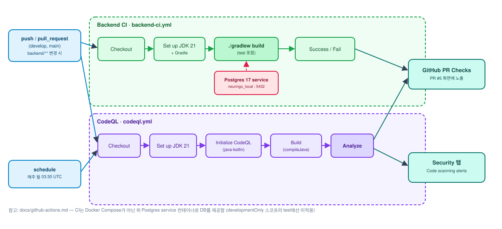

# GitHub Actions 도입 정리 (백엔드)

백엔드 CI/정적분석/로컬 DB 자동화 내용 정리. [PR #8](https://github.com/kakaotechcampus-4/ktc4-chonnam-4/pull/8)로 `develop`에 반영했고, 테스트 DB 구성은 [PR #9](https://github.com/kakaotechcampus-4/ktc4-chonnam-4/pull/9)·[PR #10](https://github.com/kakaotechcampus-4/ktc4-chonnam-4/pull/10)에서 Testcontainers 방식으로 바뀌었다.

## 파이프라인 다이어그램



## 배경

기존 `.github/workflows/`에는 멘토 배정, PR 컨벤션 안내, 디스코드 알림만 있고, **PR마다 실제로 빌드·테스트가 자동으로 도는 워크플로가 없었음.** 개발 커뮤니티 트렌드 조사 후, 비용 대비 효과가 큰 항목부터 추가함.

## 추가한 것

### 1. Backend CI — `.github/workflows/backend-ci.yml`

- **트리거**: `backend/**` 변경이 있는 `push`/`pull_request`. `branches`는 **머지 대상(base) 브랜치** 필터라 base가 `main`이거나 `develop`인 PR 전부에서 돈다 — `feature/*` → `develop` PR 도 포함이며, 이게 의도한 동작이다.
- **동작**: JDK 21 세팅 → `./gradlew build` (테스트 포함). 테스트 DB는 CI가 준비하지 않고 Testcontainers가 띄운다.
- **DB 접속 정보**: 워크플로에 넣지 않는다. `@ServiceConnection`이 컨테이너에서 읽어 런타임에 Spring으로 주입하므로 CI가 계정·비밀번호를 알 필요가 없다 — 하드코딩도 secret도 불필요.

### 2. CodeQL — `.github/workflows/codeql.yml`

- **트리거**: `push`/`pull_request` (`main`, `develop`) + 매주 월요일 03:30 UTC 정기 스캔
- **동작**: `java-kotlin` 언어로 정적분석, GitHub Security 탭에 결과 표시
- **비용**: public repo라 무료
- **PR #5 실행**: [Actions 탭](https://github.com/kakaotechcampus-4/ktc4-chonnam-4/actions/runs/35173248143)에서 확인 가능

### 3. 로컬 Postgres 자동 기동 — `spring-boot-docker-compose` + `backend/compose.yml`

- `backend/build.gradle`에 `developmentOnly 'org.springframework.boot:spring-boot-docker-compose'` 추가
- `backend/compose.yml`에 Postgres 18 서비스 정의 (포트 5432). DB 이름·계정·비밀번호는 파일에 적지 않고 `backend/.env`에서 읽는다 — `.env`는 `.gitignore` 대상이라 레포에 올라가지 않는다. 처음 받았다면 `cp backend/.env.example backend/.env` 후 값을 채운다 (값이 비면 컨테이너가 즉시 실패한다).
- 프로필 지정 없이 `./gradlew bootRun`(또는 IDE 실행)하면 Spring Boot가 `compose.yml`을 읽어 컨테이너를 자동으로 띄우고 연결까지 자동 설정
- 로컬 검증 로그: 컨테이너 생성 → `Healthy` → 앱 기동 → `/actuator/health` → `{"status":"UP"}` 확인
- 기존처럼 로컬에 Postgres를 직접 설치해서 쓰고 싶다면, `SPRING_PROFILES_ACTIVE=local` + `.env.example` 참고해서 `DB_URL`/`DB_USERNAME`/`DB_PASSWORD`를 지정하는 기존 방식도 그대로 유지됨 (두 방식 공존).

## 설계 메모 — 테스트 DB는 누가 띄우는가

`spring-boot-docker-compose`는 **developmentOnly** 스코프라 `test` 태스크의 클래스패스에는 포함되지 않는다. 그래서 처음엔 CI도 `compose.yml` 자동 기동에 맡기려 했지만 `DataSource` 빈 생성부터 실패했다 (`Failed to determine a suitable driver class`). 그다음 단계로 GitHub Actions의 `services` 블록에 Postgres를 띄우고 `local` 프로필로 테스트를 돌렸는데, 이 방식은 **워크플로 파일에 DB 접속 정보를 적어야 한다**는 문제가 남았다. public repo 라 더 그렇다.

지금은 테스트 코드가 직접 컨테이너를 띄운다 (Testcontainers).

```text
변경 전
CI 스크립트 → PostgreSQL 실행
CI 스크립트 → Gradle 실행

변경 후
CI 스크립트 → Gradle 실행
Gradle 테스트 → PostgreSQL 실행
```

- **로컬 개발(bootRun/IDE, 무프로필)** → `spring-boot-docker-compose`가 `compose.yml` 자동 기동
- **테스트(`./gradlew test`, 로컬·CI 동일)** → Testcontainers 가 `postgres:18-alpine` 기동, `@ServiceConnection` 이 접속 정보 주입
- CI 는 `SPRING_PROFILES_ACTIVE` 를 설정하지 않는다. `local` 프로필이 켜지면 `application-local.yml` 의 `${DB_USERNAME}`(기본값 없음)을 찾다가 컨텍스트 로딩이 깨진다.

## 참고

- PR: [#8 백엔드 CI/CodeQL/Spotless/로컬 Docker Compose 환경 추가](https://github.com/kakaotechcampus-4/ktc4-chonnam-4/pull/8) · [#9 Testcontainers 기반 테스트 DB](https://github.com/kakaotechcampus-4/ktc4-chonnam-4/pull/9) · [#10 CI 정리 및 DB 자격증명 하드코딩 제거](https://github.com/kakaotechcampus-4/ktc4-chonnam-4/pull/10)
- 옵션 검토 전체 목록(제외한 항목 포함): [Notion — 백엔드 개발환경 셋업 옵션 정리](https://app.notion.com/p/3de4706aa16381bdba3acc722a19d9a7)
- [backend/README.md](../backend/README.md) — 아키텍처 다이어그램, 스택별 공식 문서 링크, 로컬 환경설정 절차
