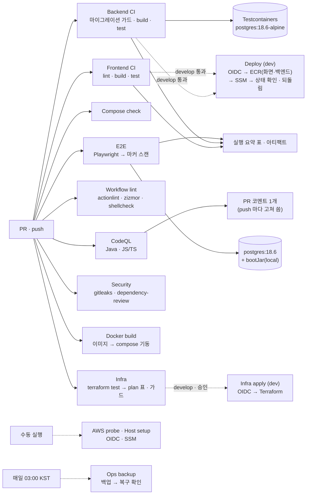

# GitHub Actions 정리

PR 과 `develop`·`main` push 에서 도는 검사를 정리한다. 모든 팀 워크플로는 로컬에서 같은 명령으로 재현할 수 있다.

```bash
bash scripts/verify.sh            # frontend + backend + workflows + infra + security
bash scripts/verify.sh frontend   # 하나만
bash scripts/verify.sh e2e        # 종단 테스트 (무거워서 전체에 넣지 않았다)
bash scripts/verify.sh docker     # 백엔드 이미지 빌드·기동 (마찬가지로 따로 돌린다)
```

테스트를 쓰는 법과 **CI 가 빨간색일 때 보는 표**는 [testing.md](testing.md) 에 있다. AWS 배포·인프라 설계는 [cd-architecture.md](cd-architecture.md) 에 있다.

## 워크플로 한눈에

| 파일 | 언제 | 무엇 | 실패하면 | 로컬 재현 |
|---|---|---|---|---|
| `frontend-ci.yml` | `frontend/**` 변경 PR·push | `npm ci` → lint → build(tsc 타입검사) → 테스트+커버리지 | 막음 | `verify.sh frontend` |
| `backend-ci.yml` | `backend/**` 변경 PR·push | 마이그레이션 가드(PR) → `./gradlew build`(Spotless·테스트) → JaCoCo 리포트 | 막음 | `verify.sh backend` |
| `compose-check.yml` | `backend/compose.yml` 변경 | 로컬 DB 컨테이너가 실제로 뜨는지 | 막음 | `docker compose up --wait` |
| `e2e.yml` | FE `src`·`e2e`·설정, BE `main`·`build.gradle`, `scripts/e2e.sh` 변경 PR · develop push | 실제 백엔드(local)·DB·프론트 빌드로 강사 흐름 브라우저 테스트 → 경고 기록 → 개인정보 마커 스캔 | E2E: PR 경고·develop 막음<br>마커 스캔: 항상 막음 | `verify.sh e2e` |
| `security.yml` | 모든 PR · develop push · 매주 월 03:00 KST | 공개하면 안 되는 파일·값(.env·키·state·계정 ID 든 ARN·로그인 포털 주소 등, `scripts/check-public-files.sh`) · gitleaks(PR 은 그 PR 커밋, 그 밖에는 전체 이력) · dependency-review(develop 로 가는 PR 의 npm) | 공개 파일·gitleaks 막음 · dependency-review 경고 | `verify.sh security` |
| `docker-build.yml` | BE `main`·Gradle 설정·`Dockerfile`·`deploy/**` 변경 PR·push | 백엔드 이미지 빌드 → root 아님 확인 → `deploy/compose.dev.yml` 로 기동해 local 프로필이 요청을 받는지(`GET /api/v1/csrf` 200). push 없음 | 막음 | `verify.sh docker` |
| `deploy.yml` | develop push 에서 Backend CI·Frontend CI 가 끝난 커밋(`workflow_run`) · 수동(develop 에서만, 커밋 SHA 로 되돌리기) | 같은 커밋의 두 CI 가 모두 통과했을 때만 `release.yml` 로 화면·백엔드를 함께 배포. 화면·백엔드를 바꾼 더 새 커밋이 있으면 옛 커밋은 건너뛴다. 변수·인프라가 없거나 서버가 꺼져 있거나 PR 미리보기 중이면 건너뛰고 Summary 에 이유 | 배포 실패·되돌림이면 빨간색 | 서버 쪽은 `scripts/test-host-deploy.sh`([deploy/README.md](../deploy/README.md)) |
| `release.yml` | 재사용(`deploy.yml`·`dev-server.yml` 이 부른다) | resolve(ECR 에 있나) → build(백엔드·화면 동시, AWS 권한 없음·캐시 없음) → deploy(ECR → SSM → 상태 확인·되돌림 → 서버에서 CloudFront 로 화면·API·커밋 확인) → 결과 보고서 | 배포 실패·되돌림·자리 있음이면 빨간색 | `scripts/test-host-deploy.sh` |
| `dev-server.yml` | 수동(develop 에서만, 팀원 누구나) | 상태 보기 · 켜기 · PR 미리보기 올리기(PR 을 develop 에 합친 코드, 미리보기 DB) · 미리보기 끝내기 · 끄기(CloudFront 먼저 닫고 서버) | 작업 실패면 빨간색 | `scripts/test-dev-server.sh`·`edge-toggle.test.mjs` |
| `host-setup.yml` | 수동 실행만(develop) | 서버 기본 설정(`deploy/host/setup.sh`)을 SSM 으로: Docker·Compose·AWS CLI·swap·journald 상한·보안 업데이트·`/opt/neuringo` | — | `SETUP_DRY_RUN=1 bash deploy/host/setup.sh` |
| `ops-backup.yml` | 매일 03:00 KST · 수동(develop) | 서버 DB 백업(`pg_dump` → S3) → 같은 서버의 임시 postgres(네트워크 없음, 끝나면 볼륨까지 지움)에 복구해 테이블·마이그레이션·행 수 확인. 숫자만 Summary 에. 배포와 같은 서버 잠금을 잡는다. 서버가 꺼져 있거나 아직 배포 전이면 건너뜀 | 백업·복구 실패면 빨간색 | `scripts/test-host-deploy.sh` |
| `infra.yml` | `infra/**`·`scripts/tf-*` 변경 PR · develop push · 매일 09:00 KST · 수동 | 검사(fmt·validate·`terraform test`·구성 검사, 자격증명 없음, PR 은 여기까지) → develop: plan(읽기만, 바뀌는 리소스·동작 표와 비용·안전 가드를 Summary 에) → Environment `infra` 승인 → 가드 다시 → apply(승인한 plan 과 같을 때만). 매일 drift. 변수가 없거나 서버가 꺼져 있으면 건너뛰고 이유를 남긴다. 사용법은 [infra/README.md](../infra/README.md) | 검사·가드·drift 막음 | `verify.sh infra` |
| `aws-probe.yml` | 수동 실행만(develop) | CD 설계 0단계. OIDC(`ktc-github-deploy`)로 읽기 호출·IAM 정책 시뮬레이션만 해서 팀 AWS 계정에서 되는 것을 표로 남긴다. 계정 ID·ARN·주소는 찍지 않는다. 변수 `AWS_ACCOUNT_ID` 가 없으면 건너뛴다 | — | `bash scripts/aws-probe.sh`(SSO 로그인 뒤) |
| `codeql.yml` | 모든 PR·push + 매주 월 03:30 UTC | 백엔드(Java)·프론트(JS/TS) 정적 보안 분석 → Security 탭. 두 언어 결과를 표로 모아 PR 코멘트·실행 요약에 남긴다(Report job) | GitHub 기본(새 고위험 경고) | — |
| `codeql-comment.yml` | CodeQL 실행이 끝난 뒤(`workflow_run`), 포크에서 온 PR 만 | 포크 PR 은 토큰이 읽기 전용이라 Report job 이 코멘트를 못 단다. develop 의 파일·권한으로 돌아 SARIF 에서 표를 다시 만들고 같은 코멘트를 단다. 포크 코드는 실행하지 않고, PR 은 head 저장소·브랜치로 찾아 head 가 분석한 커밋일 때만 단다(`scripts/codeql-comment.sh`) | — | `scripts/test-codeql-comment.sh` |
| `workflow-lint.yml` | 워크플로·`scripts/` 변경 | actionlint·shellcheck·스크립트 자체 검사(막음), zizmor(경고만) | 일부 막음 | `verify.sh workflows` |
| `assign-mentor.yml` · `convention-check.yml` · `notify-discord.yml` | `develop → main` PR | 멘토 배정·컨벤션 안내·Discord 알림 | — | **운영진 소유 — 수정 금지(CODEOWNERS)** |

- 팀 워크플로의 `pull_request` 는 base 를 좁히지 않는다. `feature/* → develop` PR 에서도 돈다.
- 같은 PR 에 다시 push 하면 이전 실행을 취소한다. `develop`·`main` push 는 취소하지 않는다.


```mermaid
flowchart LR
  PR["PR · push"] --> FE["Frontend CI<br/>lint · build · test"]
  PR --> BE["Backend CI<br/>마이그레이션 가드 · build · test"]
  PR --> CC["Compose check"]
  PR --> CQ["CodeQL<br/>Java · JS/TS"]
  PR --> WL["Workflow lint<br/>actionlint · zizmor · shellcheck"]
  PR --> E2E["E2E<br/>Playwright → 마커 스캔"]
  PR --> SEC["Security<br/>gitleaks · dependency-review"]
  PR --> DK["Docker build<br/>이미지 → compose 기동"]
  PR --> INF["Infra<br/>terraform test → plan 표 · 가드"]
  BE --> TC[("Testcontainers<br/>postgres:18.6-alpine")]
  E2E --> DB[("postgres:18.6<br/>+ bootJar(local)")]
  FE --> OUT["실행 요약 표 · 아티팩트"]
  BE --> OUT
  E2E --> OUT
  CQ --> CMT["PR 코멘트 1개<br/>(push 마다 고쳐 씀)"]
  BE -.->|"develop 통과"| DEP["Deploy (dev)<br/>OIDC → ECR(화면·백엔드)<br/>→ SSM → 상태 확인 · 되돌림"]
  FE -.->|"develop 통과"| DEP
  INF -.->|"develop · 승인"| APPLY["Infra apply (dev)<br/>OIDC → Terraform"]
  MAN["수동 실행"] -.-> PROBE["AWS probe · Host setup<br/>OIDC · SSM"]
  CRON["매일 03:00 KST"] -.-> BAK["Ops backup<br/>백업 → 복구 확인"]
```

## 결과 보는 곳

| 볼 것 | 어디 |
|---|---|
| 테스트 통과·실패 표 | 해당 실행의 **Summary**. JUnit XML 을 test-summary 가 표로 만든다. 포크 PR 에서도 보인다 |
| 커버리지 | Artifacts 의 `frontend-coverage`·`backend-coverage`(7일). 참고용이고 통과 기준이 아니다 |
| 백엔드 테스트 리포트 | 실패했을 때만 Artifacts 의 `backend-test-report` |
| E2E 리포트 | 실패했거나 재시도 끝에 통과했을 때 Artifacts 의 `e2e-report`(7일): Playwright HTML 리포트·trace, 백엔드·DB 로그 |
| E2E 경고 기록 | Issue "E2E 경고 기록". 실패·재시도 끝에 통과한 테스트가 댓글로 계속 쌓이고, 원인은 확인한 사람이 인용 댓글로 적는다 |
| lint·zizmor 지적 | PR 의 Files changed 에 줄 단위 주석 |
| gitleaks | Security 실행 로그. 비밀 값은 가려서(`--redact`) 파일·줄·규칙만 나온다 |
| dependency-review | Security 실행의 **Summary** |
| 배포 결과·건너뛴 이유 | Deploy·Dev server 실행의 **Summary**(무엇을 올렸나·확인 표·자리·다음에 누를 것, 또는 건너뛴 이유). 테스트 주소는 적지 않는다(디스코드 고정 메시지). 서버 쪽 앱 로그는 공개 로그에 싣지 않고 서버의 `/opt/neuringo/logs` 에 남긴다(SSM 세션으로 본다) |
| 백업·복구 확인 | Ops backup 실행의 **Summary**(백업 크기·테이블 수·마이그레이션 버전·행 수) |
| 인프라 plan·apply·drift | Infra 실행의 **Summary**(바뀌는 리소스·동작 표, 가드 결과, apply 결과 한 줄). plan·apply 원문과 리소스 값은 찍지 않는다. 오류는 계정 ID·ARN·IP·ID·메일을 가려 로그에 남긴다 |
| 사용자 테스트 주소 | 공개 로그·Summary 에는 찍지 않는다. 콘솔 CloudFront 또는 Parameter Store `/neuringo/dev/infra/cloudfront-domain` 에서 보고 팀에만 알린다 |
| 공개하면 안 되는 파일·값 | Security 실행 로그. 파일·줄·규칙만 나오고 값은 나오지 않는다. 커밋 전에 `bash scripts/check-public-files.sh` 로 먼저 본다 |
| AWS 에서 되는 것·안 되는 것 | AWS probe 실행의 **Summary**(✅·⛔·⚠️ 표). 결과는 [cd-architecture.md](cd-architecture.md) 의 ⚑ 표에 옮긴다 |
| CodeQL | PR: **CodeQL 코멘트** 하나. 언어별 검사 규칙 수·발견 건수, 발견하면 심각도·규칙·파일:줄 표. 0건이어도 적히고, push 할 때마다 같은 코멘트를 고쳐 쓴다(포크 PR 은 CodeQL 이 끝난 뒤 `codeql-comment.yml` 이 단다)<br>develop push·매주 실행: CodeQL 실행의 **Summary** 에 같은 표<br>고침·무시 이력과 규칙 설명: 레포 **Security → Code scanning**(로그인한 레포 멤버만). 오탐이면 여기서 이유를 적고 Dismiss 한다<br>표는 `scripts/codeql-summary.sh` 가 SARIF 에서 만든다 |

## 버전 고정 — LTS 기준

| 대상 | 값 | 이유 |
|---|---|---|
| 러너 | `ubuntu-24.04` | `ubuntu-latest` 는 2026-10-19 ~ 11-19 에 26.04 로 바뀐다. 스프린트 5~8·코드 동결과 겹쳐서 LTS 로 고정했다 |
| Java | Temurin 21 (LTS) | `backend/build.gradle` toolchain 과 같다 |
| 백엔드 이미지 | `eclipse-temurin:21.0.12_8-jdk-noble` → `-jre-noble` | 패치 버전까지 고정한다. 올릴 때는 `backend/Dockerfile` 의 두 `FROM` 을 같이 바꾼다 |
| Node | `frontend/.nvmrc` = 24 (LTS) | vitest 5·jsdom 30 이 지원하는 LTS |
| PostgreSQL | `postgres:18.6` / `18.6-alpine` | `18` 은 받는 시점마다 18.x 가 바뀌는 태그다. compose 와 Testcontainers 를 같이 올린다 |
| 액션 | 커밋 SHA + 버전 주석 | 태그는 움직일 수 있다. 올릴 때는 SHA 와 주석을 같이 바꾼다 |
| 검사 도구 이미지 | actionlint 1.7.12 · zizmor 1.30.1 · shellcheck 0.11.0 · gitleaks 8.30.1 | `scripts/verify.sh` 맨 위에 모아 두었다. 로컬과 CI 가 같은 이미지를 쓴다 |
| Playwright | `@playwright/test` 1.63(`package-lock.json`) · Chromium headless 셸 | 브라우저는 CI 에서 캐시하지 않고 매번 설치한다(Playwright 권장) |
| 테스트 도구(npm) | `axe-core` 4.13.0 · `@axe-core/playwright` 4.13.0 · `fast-check` 4.10.2 | `package.json` 에 `^` 없이 정확한 버전으로 적었다(`--save-exact`). 올릴 때는 `package.json` 과 `package-lock.json` 을 같은 PR 에서 바꾼다. 쓰는 곳은 [testing.md](testing.md#테스트-유형) |
| Gradle 캐시 | `setup-gradle` v6 `cache-provider: basic` | v6 기본값은 독점 캐시다. MIT 인 기본 캐시를 쓴다 |
| Terraform | 이미지 `hashicorp/terraform:1.16.4`(+ digest) · `hashicorp/aws` 6.67.0 · `hashicorp/random` 3.9.1 | 이미지는 `scripts/tf-run.sh` 에 태그와 digest 로, 버전은 모듈마다 `required_version`·`required_providers` 에 `=` 로, 해시는 `.terraform.lock.hcl` 에 고정한다(`init -lockfile=readonly`). 올릴 때는 셋을 같은 PR 에서 바꾼다 |
| AWS 인증 액션 | `aws-actions/configure-aws-credentials` v6.3.0(SHA) | 운영진 OIDC 가이드 예시는 v4 다. 입력(`role-to-assume`·`aws-region`)이 같아서 최신으로 쓰고, 계정 ID 를 가린다(`mask-aws-account-id`) |

## secret

**머지 전에 꼭 등록할 secret 은 없다.**
- AWS 는 secret 이 아니라 저장소 **변수** `AWS_ACCOUNT_ID` 하나다. OIDC 로 1시간짜리 자격증명을 받으므로 액세스 키를 두지 않는다(팀 계정에서는 만들 수도 없다).
- `ALERT_EMAILS`(선택): 경보·예산 메일 주소 JSON 배열(예: `["a@example.com"]`). Infra 가 Terraform 변수로 넘긴다. 없으면 메일 구독 없이 만든다.
- 서버 켜기·끄기·CloudFront 여닫기는 **Dev server** 가 한다(변수 없음, [infra/README.md](../infra/README.md) "서버를 끄고 켤 때"). 옛 변수 `EDGE_ENABLED` 는 쓰지 않는다(지운다).
- Environment `infra`(승인자 지정, develop 만)는 첫 apply 전에, `dev`(develop 만, 승인자 없음)는 머지 전에 만든다. 없으면 GitHub 이 보호 없는 환경을 자동으로 만든다.
- `AWS_ACCOUNT_ID` 는 변수라 각 단계 머리에 그대로 찍힌다(운영진 가이드: 비밀값이 아님). 숨기려면 같은 이름의 secret 으로 옮긴다.
- SSH 배포용 secret(`DEV_*`)은 등록하지 않는다. AWS 환경은 22번을 열지 않는다([cd-architecture.md](cd-architecture.md)).
- 테스트 DB 계정은 Testcontainers 가 컨테이너마다 만들어 주입한다.
- compose 검사는 매 실행 `openssl` 로 일회용 값을 만든다.
- E2E 의 DB 계정도 `scripts/e2e.sh` 가 실행마다 무작위로 만든다.
- 워크플로에는 어떤 자격증명도 적지 않는다.
- `GITHUB_TOKEN` 은 GitHub 이 자동으로 넣는다.
- 포크에서 온 PR 은 secret 을 받지 못하고 토큰이 읽기 전용이다. 그래서 결과는 실행 요약·아티팩트로 남긴다. CodeQL 코멘트는 같은 레포 브랜치 PR 이면 Report job 이, 포크 PR 이면 `codeql-comment.yml`(`workflow_run`, 포크 코드는 실행하지 않음)이 단다.

## 1차 도입 — 막는 검사와 경고

결과가 매번 같은 검사만 막는다. 새로 들어왔거나 판단이 들어가는 검사는 경고로 시작한다. 전환 조건은 [testing.md](testing.md#경고--차단-전환-조건)에 있다.

- **막음**: lint·build·테스트, 마이그레이션 가드, compose 기동, actionlint, shellcheck, 개인정보 마커 스캔, 공개 파일 검사·gitleaks(PR 범위), E2E(develop push), 이미지 빌드·기동, Terraform 검사·구성 검사·plan 가드·drift
- **경고**: zizmor(워크플로 보안), E2E(PR — 브라우저 테스트는 환경 탓으로 흔들릴 수 있다), dependency-review
- 머지를 실제로 막는 "필수 체크" 지정은 브랜치 보호 설정이라 운영진·멘토와 DEC-021 로 정한다.

## 설계 메모 — 테스트 DB 는 누가 띄우는가

`spring-boot-docker-compose` 는 **developmentOnly** 스코프라 `test` 태스크의 클래스패스에는 없다. 처음에는 CI 도 `compose.yml` 자동 기동에 맡기려 했지만 `DataSource` 빈 생성부터 실패했다(`Failed to determine a suitable driver class`). 다음으로 GitHub Actions 의 `services` 블록에 Postgres 를 띄웠더니 워크플로에 DB 접속 정보를 적어야 했다. public repo 라 더 곤란했다.

지금은 테스트 코드가 직접 컨테이너를 띄운다(Testcontainers).

```text
변경 전: CI 스크립트 → PostgreSQL 실행, CI 스크립트 → Gradle 실행
변경 후: CI 스크립트 → Gradle 실행 → Gradle 테스트가 PostgreSQL 실행
```

- **테스트**(`./gradlew test`, 로컬·CI 동일): Testcontainers 가 `postgres:18.6-alpine` 을 띄우고 `@ServiceConnection` 이 접속 정보를 주입한다.
- **CI 는 `SPRING_PROFILES_ACTIVE` 를 설정하지 않는다.** `local` 프로필이 켜지면 `application-local.yml` 의 `${DB_USERNAME}`(기본값 없음)을 찾다가 컨텍스트 로딩이 깨진다.
- **로컬 개발**
  - 무프로필 `bootRun` 이면 `spring-boot-docker-compose` 가 `compose.yml` 을 자동으로 띄운다.
  - PR #28 이후 모든 프로필이 같은 토큰 인증을 쓴다. 가입·로그인·CSRF 토큰(`GET /api/v1/csrf`) 말고는 로그인해야 하고(없으면 401), `/actuator/health` 도 지금은 로그인해야 본다(공개 여부는 팀 결정 전). 그래서 E2E·Docker 검사는 `GET /api/v1/csrf` 200 으로 앱이 떴는지 본다.
  - 프론트에서 API 를 부르려면 `local` 프로필로 실행하고 `DB_USERNAME`·`DB_PASSWORD` 를 **환경변수**로 넘겨야 한다. Spring 은 `backend/.env` 파일을 읽지 않는다. 그 파일은 docker compose 만 읽는다.

## 마이그레이션 가드

`scripts/check-migrations.sh` 는 PR 에서 base 브랜치와 비교해 아래를 막는다.
- 이미 있던 `V*.sql` 을 고치거나 지운 경우
- 새 버전 번호가 기존 최대값 이하이거나 겹치는 경우
- 파일 이름이 규칙과 다른 경우

적용된 DB 는 체크섬이 달라지면 기동하지 못한다. 그런데 CI 는 매번 빈 DB 에 처음부터 적용하므로 테스트로는 잡을 수 없다. 스크립트 자체의 동작은 `scripts/test-check-migrations.sh` 가 검사한다.

## 이력

- [PR #8](https://github.com/kakaotechcampus-4/ktc4-chonnam-4/pull/8): 백엔드 CI·CodeQL·Spotless·로컬 Docker Compose
- [PR #9](https://github.com/kakaotechcampus-4/ktc4-chonnam-4/pull/9)·[PR #10](https://github.com/kakaotechcampus-4/ktc4-chonnam-4/pull/10): Testcontainers 기반 테스트 DB, CI 의 DB 자격증명 제거
- [PR #13](https://github.com/kakaotechcampus-4/ktc4-chonnam-4/pull/13): postgres 18 볼륨 경로 수정, compose 기동 검사
- `ci/cd_minseo-7`: 스프린트 1 CI/CD·테스트 (커밋 3개 — 테스트·설정·문서)
  - 프론트 CI·테스트 기반(Vitest·MSW), 마이그레이션 가드, workflow lint, 실행 요약·커버리지 리포트
  - CodeQL 에 프론트(JS/TS) 분석을 더하고 결과를 PR 코멘트·실행 요약 표로(PR #19 를 이 브랜치로 합침)
  - 테스트 유형 확대: FE ↔ BE API 명세 일치(`contracts/`), 경계값, 보안 행렬, 로그 개인정보, 스키마 무결성, 동시 등록, AI 제공자 연동 규칙, 속성 기반(fast-check), 접근성(axe), 실패 경로·태블릿 E2E
  - 러너·버전 LTS 고정, 액션 SHA 고정, postgres 18.6 고정(PR #16 멘토 리뷰 반영)
  - 백엔드 공통 검사(보안 정책·스키마 제약·학급 격리·AI 전달 게이트·ArchUnit), `@IntegrationTest`·`TestFixtures`
  - E2E(Playwright) + 개인정보 마커 스캔, Security(gitleaks·dependency-review)
  - 백엔드 이미지(Temurin 21 멀티스테이지·비루트), Docker build 검사, 개발 서버 배포 골격(`deploy/`, `deploy-dev.yml` — `ci/cd_minseo-11` 에서 `deploy.yml` 로 바꿈)
  - #17·#18 후속: MSW 422 `fieldErrors: [{ field, message }]`, E2E 중복 제출 확인·`getByLabel`, ArchUnit 계층 방향
- `ci/cd_minseo-10`: AWS CD·인프라 설계([cd-architecture.md](cd-architecture.md)), 0단계 권한 확인(`aws-probe.yml`·`scripts/aws-probe.sh`·자체 검사)
- `ci/cd_minseo-11`: 1단계 배포
  - `deploy.yml`(SSH 골격 대체)·`host-setup.yml`·`ops-backup.yml`, 서버 스크립트(`deploy/host/`: 배포·되돌리기·백업·복구 확인·기본 설정), SSM 실행·배포 묶음·프론트 배포·인프라 값 읽기 스크립트와 자체 검사
  - Terraform `infra/`(ECR·S3·CloudFront·보안 그룹 규칙·Parameter Store·로그·경보·예산, mock 테스트)와 `infra.yml`(승인 전 plan 표·가드, 승인 뒤 apply, 매일 drift), state 버킷·실행·가드 스크립트와 자체 검사
  - 공개 파일 검사(`check-public-files.sh`, Security), 독립 보안 검토 반영(PR 자격증명 차단, 수동 실행 develop 한정, 프론트 빌드 권한 분리, 되돌리기에 설정 포함, 복구 확인 볼륨 삭제, 서버 꺼짐 처리)

## 참고

- 옵션 검토 전체 목록(제외한 항목 포함): [Notion — 백엔드 개발환경 셋업 옵션 정리](https://app.notion.com/p/3de4706aa16381bdba3acc722a19d9a7)
- [backend/README.md](../backend/README.md): 아키텍처, 스택별 공식 문서, 로컬 환경설정 절차
