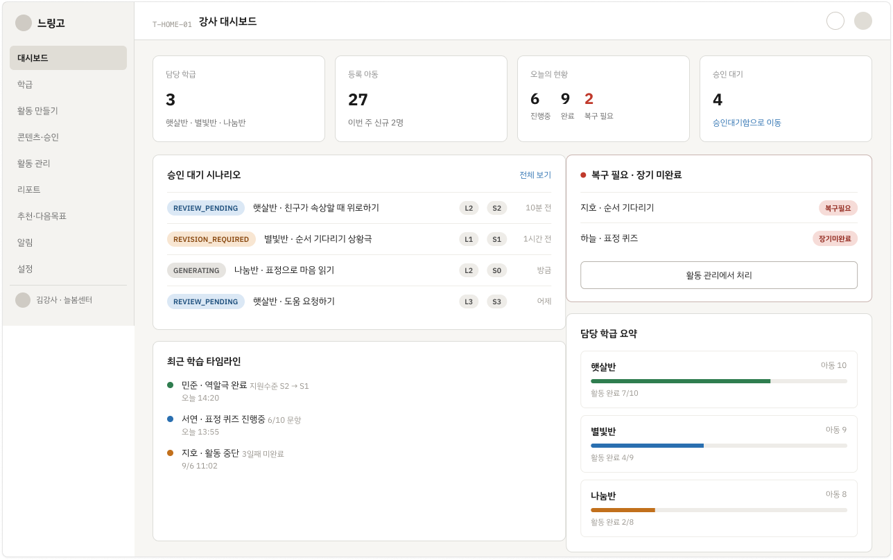
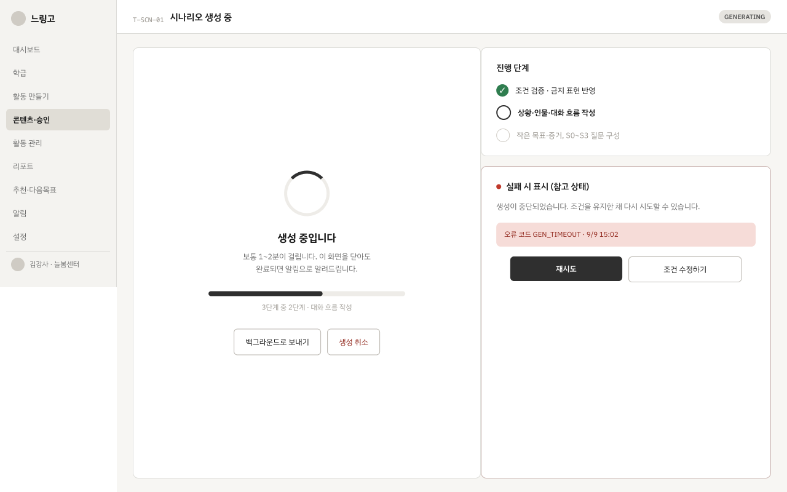
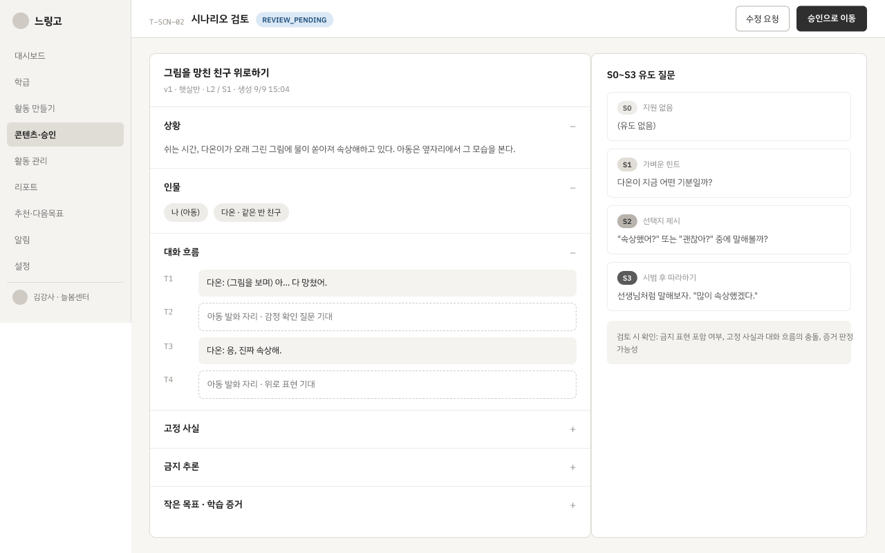
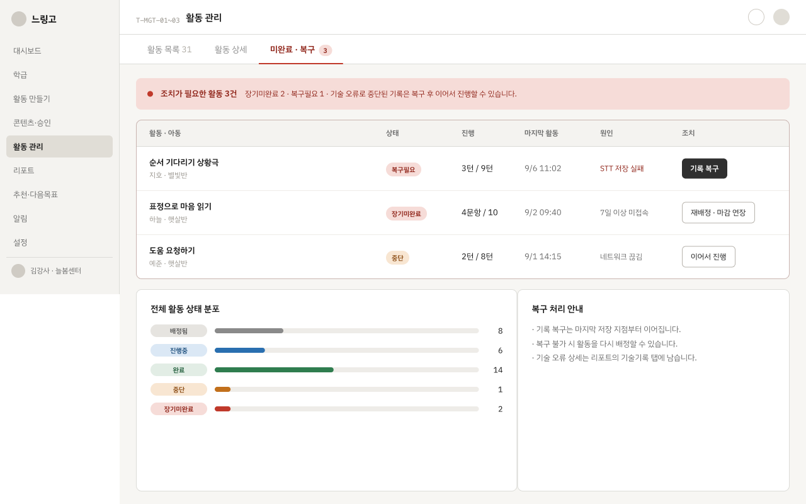

# Week 1 와이어프레임

느린 학습자를 위한 감정 인식·공감 역할극 서비스 **느링고**의 1주 차 와이어프레임 작업물입니다.

이번 주에는 운영자 콘솔을 제외한 전체 사이트맵을 기준으로 공통·인증, 강사, 아동, 보호자 영역의 화면을 설계했습니다. 본 와이어프레임은 서비스 구조와 핵심 흐름을 검토하기 위한 초안이며, 팀원 피드백과 후속 정책 결정에 따라 변경될 수 있습니다.

## Figma

- [느링고 와이어프레임 전체 보기](https://www.figma.com/design/e8MHxdATXOGFic3C9R68D/%EB%8A%90%EB%A7%81%EA%B3%A0?node-id=11-704&t=PcSMPDdLA8NJkd9w-0)

## 이번 주 작업 범위

### 포함

- 공통·인증 화면
- 강사 서비스 전체 화면
- 아동 서비스 전체 화면
- 보호자 영역 화면
- 입력, 처리, 네트워크, 권한, 오류 등 주요 상태 화면과 오버레이

### 제외

- 운영자 콘솔

## 전체 사이트맵

    느링고
    ├─ 공통·인증
    │  ├─ 서비스 시작
    │  ├─ 강사 로그인·가입·초대 수락
    │  ├─ 비밀번호 재설정
    │  ├─ 약관·개인정보 처리 안내
    │  └─ 오류·접근 제한
    │
    ├─ 강사 서비스
    │  ├─ 온보딩
    │  │  ├─ 서비스 소개
    │  │  ├─ 데이터 운영 정책 확인
    │  │  └─ 첫 학급 만들기 / 데모 학급
    │  ├─ 대시보드
    │  │  ├─ 오늘의 현황
    │  │  ├─ 승인 대기 시나리오
    │  │  ├─ 미완료·복구 필요 활동
    │  │  └─ 최근 학습 및 알림
    │  ├─ 학급
    │  │  ├─ 학급 목록·생성·수정
    │  │  └─ 학급 상세
    │  │     ├─ 개요·아동 목록
    │  │     ├─ 배정 활동
    │  │     └─ 학급 리포트
    │  ├─ 아동
    │  │  ├─ 아동 등록·일괄 등록
    │  │  └─ 아동 상세
    │  │     ├─ 개요·학습 상태
    │  │     ├─ 접근 코드·QR
    │  │     ├─ 활동 이력·리포트
    │  │     └─ 추천 학습
    │  ├─ 활동 만들기
    │  │  ├─ 대상·활동 유형 선택
    │  │  ├─ 학습 목표·추가 조건 설정
    │  │  ├─ 난이도 결정
    │  │  ├─ 시나리오 재사용·생성·검토
    │  │  └─ 배정 설정·완료
    │  ├─ 콘텐츠·승인
    │  │  ├─ 시나리오 목록·승인 대기함
    │  │  ├─ 시나리오 상세·버전 이력
    │  │  └─ 반려·재생성·폐기
    │  ├─ 활동 관리
    │  │  ├─ 활동 목록·상세
    │  │  └─ 미완료·복구 필요 활동
    │  ├─ 리포트
    │  │  ├─ 학급·아동 리포트
    │  │  └─ 활동 리포트 상세
    │  ├─ 추천 및 다음 목표
    │  │  ├─ 추천 학습 목록·상세·근거
    │  │  └─ 다음 목표 확정
    │  ├─ 알림
    │  └─ 설정
    │     ├─ 계정·기관 정보
    │     ├─ 개인정보·데이터 요청
    │     └─ 로그아웃
    │
    ├─ 아동 서비스
    │  ├─ 접속
    │  │  ├─ 코드 입력 / QR 진입
    │  │  └─ 본인 활동 확인
    │  ├─ 첫 사용 안내
    │  │  ├─ 쉬운 사용 안내
    │  │  ├─ 마이크·스피커 확인
    │  │  └─ 카메라 동의·권한 확인
    │  ├─ 내 활동
    │  │  ├─ 배정 활동 목록·활동 소개
    │  │  └─ 이어 하기
    │  ├─ 표정 퀴즈
    │  │  ├─ 내 감정 알기—상황 제시
    │  │  ├─ 상대 감정 알기—상황 제시
    │  │  ├─ 상대 감정 알기—이미지 제시
    │  │  ├─ 힌트·재시도
    │  │  └─ 퀴즈 완료
    │  ├─ 역할극
    │  │  ├─ 역할극 소개·대화 진행
    │  │  ├─ 음성 재입력·입력 확인
    │  │  ├─ 텍스트 대체 입력
    │  │  ├─ 일시 중단·이어 하기
    │  │  └─ 역할극 마무리
    │  └─ 활동 완료
    │     ├─ 쉬운 성취 피드백
    │     ├─ 스탬프 지급
    │     └─ 다음 활동 안내
    │
    └─ 보호자 영역
       ├─ 동의 요청·본인 확인
       ├─ 개인정보 처리 안내
       ├─ 동의 현황·철회
       ├─ 아동 학습 결과 요약
       └─ 개인정보 열람·수정·삭제 요청

> 운영자 콘솔은 전체 정보 구조에는 존재하지만 이번 주 와이어프레임 작업 범위에서는 제외했습니다. 보호자 영역의 상세 정책과 학습 결과 화면은 MVP 이후 확정될 수 있습니다.

## 이번 주에 설계한 화면 목록

### 공통·인증

| 구분 | 화면 |
| --- | --- |
| 서비스 진입 | 서비스 시작, 오류·접근 제한 |
| 강사 인증 | 로그인, 가입, 초대 수락, 비밀번호 재설정 |
| 정책 | 약관 및 개인정보 처리 안내 |

### 강사 서비스

| 구분 | 화면 |
| --- | --- |
| 온보딩 | 서비스 소개, 데이터 운영 정책 확인, 첫 학급 만들기, 데모 학급 |
| 대시보드 | 오늘의 현황, 승인 대기 시나리오, 미완료·복구 필요 활동, 최근 학습 및 알림 |
| 학급 관리 | 학급 목록, 생성·수정, 상세 개요, 아동 목록, 배정 활동, 학급 리포트 |
| 아동 관리 | 아동 등록·일괄 등록, 상세 개요, 접근 코드·QR, 활동 이력, 리포트, 추천 학습 |
| 활동 만들기 | 대상·유형 선택, 목표·조건 설정, 난이도 결정, 시나리오 재사용·생성·검토, 배정 |
| 콘텐츠·승인 | 시나리오 목록, 승인 대기함, 상세·버전 이력, 반려·재생성·폐기 |
| 활동 관리 | 활동 목록·상세, 미완료·복구 필요 활동 |
| 리포트 | 학급·아동 리포트, 활동 리포트 상세 |
| 다음 학습 | 추천 학습 목록·상세·근거, 다음 목표 확정 |
| 기타 | 알림, 계정·기관 설정, 개인정보·데이터 요청, 로그아웃 |

### 아동 서비스

| 구분 | 화면 |
| --- | --- |
| 접속 | 코드 입력·QR 진입, 본인 활동 확인 |
| 첫 사용 | 쉬운 사용 안내, 마이크·스피커 확인, 카메라 동의·권한 확인 |
| 내 활동 | 배정 활동 목록, 활동 소개, 이어 하기 |
| 표정 퀴즈 | 내 감정 알기, 상대 감정 알기, 힌트·재시도, 퀴즈 완료 |
| 역할극 | 소개, 대화, 입력 확인, 텍스트 대체 입력, 일시 중단·이어 하기, 마무리 |
| 활동 완료 | 쉬운 성취 피드백, 스탬프 지급, 다음 활동 안내 |

### 보호자 영역

| 구분 | 화면 |
| --- | --- |
| 동의 | 동의 요청·본인 확인, 개인정보 처리 안내, 동의 현황·철회 |
| 학습 정보 | 아동 학습 결과 요약 |
| 데이터 권리 | 개인정보 열람·수정·삭제 요청 |

### 상태 화면·오버레이

- 녹음 시작·진행·완료 및 STT 입력 확인
- 무음, 시간 초과, 업로드 실패 및 재입력
- 카메라 권한 거부·촬영 실패 및 대체 입력
- AI 분석·응답 생성·검증 중 대기 상태
- 네트워크 연결 끊김, 임시 저장, 재전송 및 복구 완료
- 시나리오 생성·재생성, 승인·반려·폐기 확인
- 활동 나가기, 일시 중단 및 이어 하기 확인
- 안전 안내, 접근 제한, 만료 코드 및 일반 오류

## 대표 화면

### 강사 대시보드

담당 학급, 등록 아동, 오늘의 활동 현황, 승인 대기 시나리오, 복구가 필요한 활동과 최근 학습을 한눈에 확인하는 화면입니다.

### 강사 시나리오 생성

시나리오 생성 진행 단계와 실패 상태를 확인하고, 재시도하거나 생성 조건을 수정할 수 있는 화면입니다.

### 강사 시나리오 검토

상황, 인물, 대화 흐름과 S0~S3 유도 질문을 검토하고 수정 요청 또는 승인으로 이동하는 화면입니다.

### 강사 활동 관리

배정된 활동의 상태와 진행 정도를 확인하고, 장기 미완료·저장 실패·중단 활동을 복구하는 화면입니다.

### 아동 표정 퀴즈

내 감정 알기, 상대 감정 알기, 힌트·재시도와 퀴즈 완료까지 아동의 표정 퀴즈 흐름을 구성한 화면입니다.

## 다음 작업 범위

- 팀원 피드백을 반영해 와이어프레임 수정
- 화면별 예외·오류 상태 보완
- 디자인 시스템 구축
